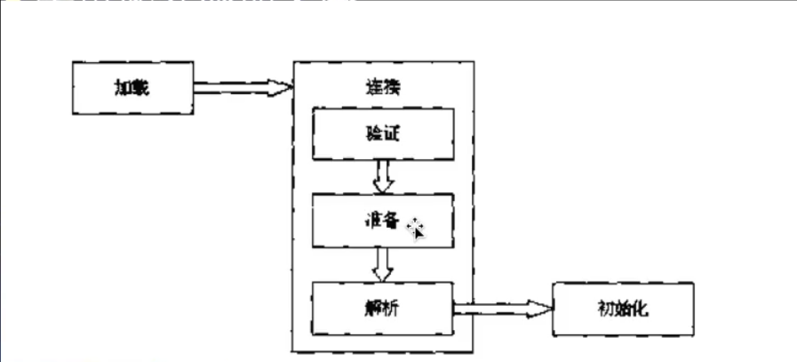

### 一、类加载

- 在Java代码中，类型（Java Class）的加载、连接与初始化过程都是在程序运行期间完成的。
- 提供了更大的灵活性，增加了更多的可能性

#### 1. Java虚拟机与程序的生命周期

- 在如下几种情况下，Java虚拟机会结束生命周期：
  - 执行了Systemn.exit()方法
  - 程序正常执行结束
  - 程序在执行过程中遇到了异常或错误而异常终止
  - 由于操作系统出现错误而导致Java虚拟机进程终止

#### 2. 类加载过程

类加载过程包括：加载、连接与初始化

- `加载`：查找并加载类的二进制数据
- `连接`
  - `验证`：确保被加载的类的正确性
  - `准备`：为类的`静态变量`分配内存，并将其初始化为`默认值`（零值）
  - `解析`：把类中的符号引用转换为直接引用

- `初始化`：为类的静态变量赋予正确的初始值



#### 3. 类的使用与卸载

- 使用：类加载完成后就可以在程序中使用
- 卸载：被加载的类可以被卸载，卸载后就无法再使用

#### 4. 类的使用方式

Java程序对类的使用方式可分为两种：

- `主动使用`

  以下`七种情况`都是对类的主动使用：

  - 创建类的实例
  - 访问某个类或接口的静态变量（`getstatic`），或者对该静态变量赋值（`putstatic`）
  - 调用类的静态方法（`invokestatic`）
  - 反射（如`Class.forName("com.test.Test")`)
  - 初始化一个类的子类时，是对父类的主动使用
  - Java虚拟机启动时被表明为启动类的类（main方法）
  - JDK1.7开始提供的动态语言支持：
    - `java.lang.invoke.MethodHandle`实例的解析结果REF_getStatic，REF_putStatic，REF_invokeStatic句柄对应的类没有初始化，则初始化

- `被动使用`

  除了以上七种主动使用的情况，其他使用Java类的方式都被看作对类的被动使用

> **两个重要结论：**
>
> - 所有的Java虚拟机实现必须在每个类或接口被Java程序`首次主动使用`时才初始化他们
> - 除了以上七种情况，其他使用Java类的方式都被看作对对类的`被动使用`，都不会导致类的`初始化`。

#### 5. 类的加载

类的加载指的是将类的.class文件中的二进制数据读入到内存中，将其放在运行时数据区的方法区内，然后在内存中创建一个`java.lang.Class`对象（规范并未说明Class对象位于哪里，HotSpot虚拟机将其放在了方法区中）用来封装类在方法区内的数据结构。

##### 类加载方式

加载.class文件包括多种方式，如：

- 从本地系统中直接加载
- 通过网络下载.class文件
- 从zip，jar等归档文件中加载.class文件
- 从专有的数据库中提取.class文件
- 将Java源文件动态编译为.class文件 （如JSP）

#### 6. 程序示例

##### 程序示例1

本示例演示类的主动使用、被动使用

代码1：

```java
package com.yglong.jvm.classloader;

public class MyTest1 {
    public static void main(String[] args) {
		System.out.println(MyChild1.str);
        // System.out.println(MyChild1.welcome);
    }
}

class MyParent1 {
    public static String str = "Hello world";
    // 注意：静态代码块只有在类被初始化时才会被执行
    static {
        System.out.println("MyParent1 static block");
    }
}

class MyChild1 extends MyParent1 {
    public static String welcome = "welcome";
    static {
        System.out.println("MyChild1 static block");
    }
}
```

输出结果：

```java
MyParent1 static block
Hello world
```

解析：

- 执行程序main方法时，访问了MyParent1类的静态变量`str`，满足七种主动使用情况中的情况之一：访问类的静态变量，因此是对MyParent1的主动使用，所以MyParent1会被初始化。而初始化类时会执行静态代码块内的代码，因此打印`MyParent1 static block`。

- 虽然是通过MyChild1来引用的str，但是并不是访问的MyChild1的静态变量，因此并不是对MyChild1的主动使用，所以不会初始化MyChild1类，因此MyChild1的静态代码块并不会执行

修改代码如下：

代码2：

```java
package com.yglong.jvm.classloader;

public class MyTest1 {
    public static void main(String[] args) {
		// System.out.println(MyChild1.str);
        System.out.println(MyChild1.welcome);
    }
}

class MyParent1 {
    public static String str = "Hello world";
    // 注意：静态代码块只有在类被初始化时才会被执行
    static {
        System.out.println("MyParent1 static block");
    }
}

class MyChild1 extends MyParent1 {
    public static String welcome = "welcome";
    static {
        System.out.println("MyChild1 static block");
    }
}
```

输出结果：

```java
MyParent1 static block
MyChild1 static block
welcome
```

解析：

- 这次执行程序main方法时，访问了MyChild1的静态变量`welcome`，因此是对MyChild1的主动使用，因此会初始化MyChild1类。
- 而初始化一个类时，要求其父类全部都已经初始化完毕，因此MyParent1会先被初始化，然后初始化MyChild1，所以先执行了MyParent1的静态代码块，然后再执行MyChild1的静态代码块。

**结论：**

- 对于静态字段来说，只有直接定义了该字段的类才会被初始化。
- 当一个类在初始化时，要求其父类全部都已经初始化完毕了。

> 对于代码1，虽然MyChild1没有被初始化，但是它有没有被加载呢？
>
> 我们可以来追踪一下，在运行时加上`-XX:+TraceClassLoading`，就可以追踪类的加载信息并打印出来。
>
> 经笔者测试，对于Oracle JDK自带的HotSpot虚拟机，MyChild1类是会被加载的，只是加载后并不会被初始化。

**JVM选项介绍**

所有选项都是以`-XX:`开始，有三种类型：

- `-XX:+<option>`，表示开启option选项
- `-XX:-<option>`，表示关闭option选项
- `-XX:<option>=<value>`，表示将option选项的值设置为value

##### 程序实例2

本示例演示静态常量

```java
package com.yglong.jvm.classloader;

public class MyTest2 {
    public static void main(String[] args) {
        System.out.println(MyParent2.str);
    }
}

class MyParent2 {
    public static final String str = "hello world";
    
    static {
        System.out.println("MyParent2 static block");
    }
}
```

该程序与第一个实例的代码1唯一不同的是在str静态变量上加了一个final将其变为一个常量。

但是输出却不同，输出如下：

```java
hello world
```

解析：

- 常量在编译阶段会存入到调用这个常量的方法所在的类的常量池中，本质上，调用类并没有直接引用到定义常量的类，因此不会触发定义常量的类的初始化。而且根据追踪类加载信息，定义常量的类甚至不会被加载。

- 对于该示例，在编译阶段常量str的值被存放到了MyTest2的常量池中，之后MyTest2与MyParent2就没有任何关系了。这时候即使将MyParent2的class文件删除，也可以正常运行MyTest2。

我们可以将编译后的MyTest2.class文件反编译来看一下。

执行命令：

```java
javap -c com.yglong.jvm.classloader.MyTest2
```

输出如下：

```java
Compiled from "MyTest2.java"
public class com.yglong.jvm.classloader.MyTest2 {
  public com.yglong.jvm.classloader.MyTest2();
    Code:
       0: aload_0
       1: invokespecial #1                  // Method java/lang/Object."<init>":()V
       4: return

  public static void main(java.lang.String[]);
    Code:
       0: getstatic     #2                  // Field java/lang/System.out:Ljava/io/PrintStream;
       3: ldc           #4                  // String hello world
       5: invokevirtual #5                  // Method java/io/PrintStream.println:(Ljava/lang/String;)V
       8: return
}
```

可以看到这一行：

```java
3: ldc           #4                  // String hello world
```

`ldc`是一个助记符，它表示将int（除了`bipush`，`sipush`支持的整数和`iconst_1` ~ `iconst_5`外），float或String类型的常量值从常量池中推送至栈顶。

> **其他常见助记符：**
>
> - bipush：表示将单字节的常量值（-128 ~ 127）推送至栈顶
> - sipush：表示将一个短整型的常量值（-32768 ~ 32767）推送至栈顶
> - iconst_1 ~ iconst_5：表示将int类型的数字1~5推送至栈顶