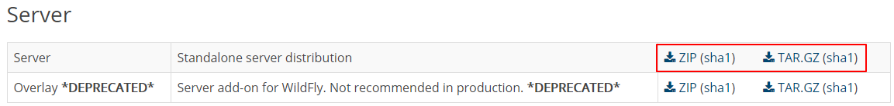
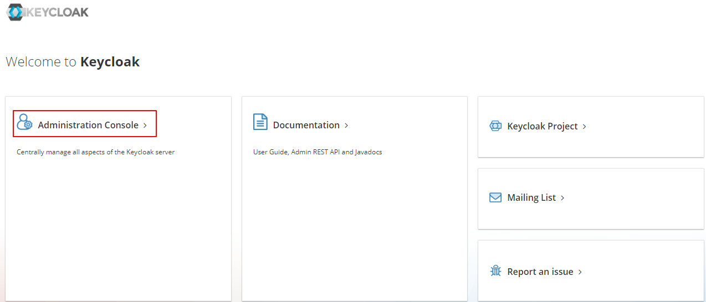
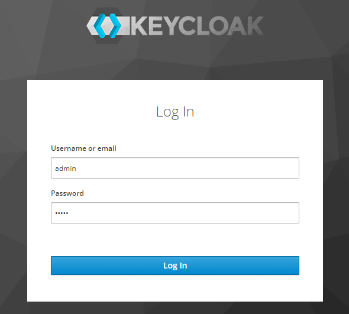
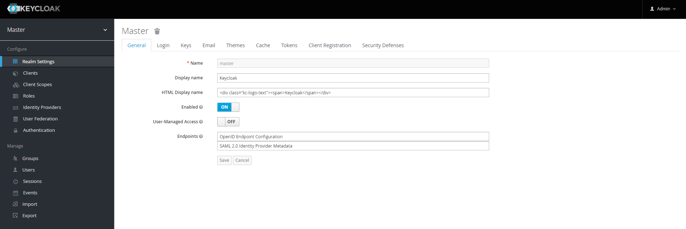
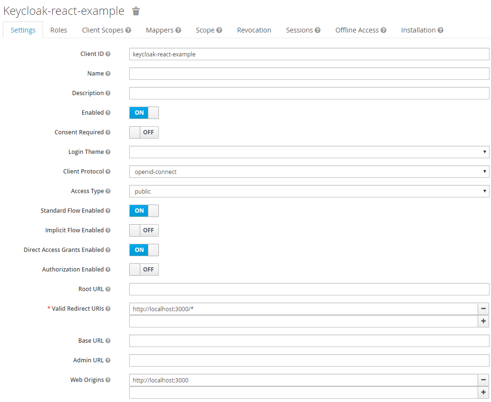
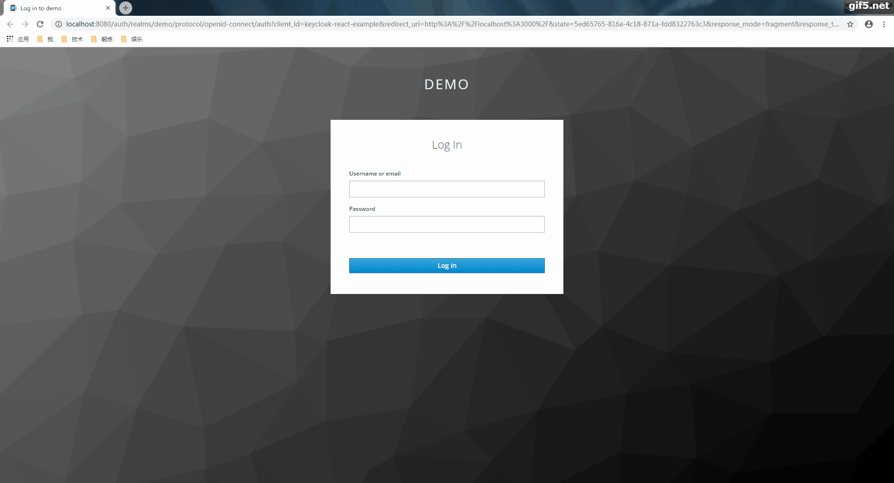
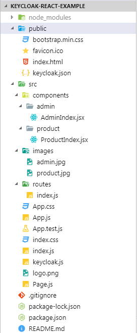
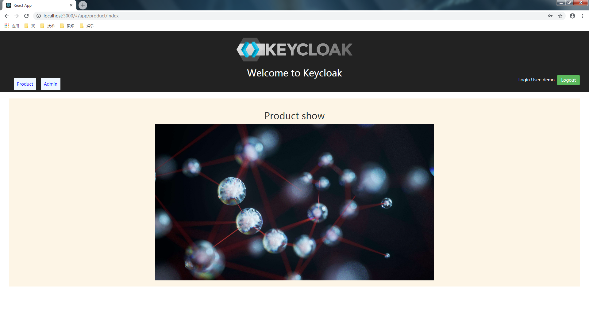

`Keycloak`是一个开源的身份和访问管理系统，它可以轻松与任何web应用集成，从而为web应用提供访问控制管理功能。 具体的`Keycloak`介绍请参见[官方网站](https://www.keycloak.org/)。 本文的目的不是介绍`keycloak`的原理，而是介绍如何将`keycloak`与基于`React`的应用进行集成。 本文将实现一个具体的`React`应用，然后与`keycloak`集成，最终实现访问该`React`应用时的用户登录与验证功能。

### Keycloak安装与配置

`Keycloak`以独立的服务的方式运行，它通过独立的服务向单个或多个应用提供集中式的服务。因此我们首先需要安装部署`Keycloak`服务。

#### Keycloak安装

首先在官方网站的[下载页面](https://www.keycloak.org/downloads.html)下载`Keycloak`的软件包。 

 

下载后解压到某目录，然后打开`cmd`进入`bin`目录。 `Keycloak`支持集群模式和单机模式，我们以单机模式运行`Keycloak`，运行如下命令：

```bash
.\standalone.bat
```

如果你看到类似如下的输出，就说明`Keycloak`成功安装并启动起来了：

```bash
22:01:27,605 INFO  [org.jboss.as] (Controller Boot Thread) WFLYSRV0060: Http management interface listening on http://127.0.0.1:9990/management
22:01:27,605 INFO  [org.jboss.as] (Controller Boot Thread) WFLYSRV0051: Admin console listening on http://127.0.0.1:9990
22:01:27,606 INFO  [org.jboss.as] (Controller Boot Thread) WFLYSRV0025: Keycloak 6.0.1 (WildFly Core 8.0.0.Final) started in 24304ms - Started 580 of 842 services (560 services are lazy, passive or on-demand)
```

接下来，我们在浏览器中输入url：[http://localhost:8080](http://localhost:8080)，打开Keycloak管理界面。 

首次打开界面时，需要创建一个管理账户。 

创建好账户后，点击“Administration Console”： 

 

输入用户名密码，点击登录： 

 

登入后，进入Keycloak管理控制台首页： 




#### Keycloak配置

接下来介绍如何在`Keycloak`管理控制台中进行配置。 

首次进入控制台，`Keycloak`默认有一个名为`master`的realm。我们需要创建我们自己的realm。例如我们这里创建一个名为`demo`的realm。 

接下来创建用户，我们可以创建一个或多个用户，注意创建的用户只能登录用户所在的realm。这里我们创建一个用户`demo`。 

创建realm和用户后，我们需要为我们的react应用创建一个client，这里命名为`keycloak-react-example`。创建client后，还需要设置几个必须的参数，参考下图：

  
 
 注意，对于web前端应用，`Access Type`必须是`public`。 
 
 `Web Origins`虽然不是必须的，但是一般都需要设置，以避免因跨域而无法访问的问题。


### 开发React应用

接下来，我们开发一个简单的React应用。

#### 应用效果

首先来看看我们的应用的最终效果吧！ 



应用功能包括：

-   每当访问应用时，总是会被导向到用户登录界面，要求输入用户名及密码登录应用。
-   登录应用后，会自动重定向到 product 页面。
-   点击`Product`或`Admin`菜单，可以进入 product 或 admin 页面。
-   在 product 或 admin 任何页面，点击`Logout`按钮，就可以退出登录，会被自动重定向到用户登录页面。
-   输入用户名密码再次登录，会默认进入刚才退出时访问的页面。

#### 功能页面开发

首先，我们开发功能页面，也就是product和admin页面。我们暂时不集成`Keycloak`，待功能页面开发好后，再集成keycloak。 

要开发React应用，首选使用`create-react-app`脚手架。首先安装`create-react-app`（前提是你已经安装了npm）：

```bash
npm install -g create-react-app
```

接下来，使用`create-react-app`脚手架创建我们的应用项目结构：

```bash
create-create-app keycloak-react-example
```

运行命令后可以帮我们创建一个应用骨架，包括必须的一些目录结构及文件。 我们最终实现的代码结构如下所示：

 

我们需要首先在根目录下的package.json中添加依赖：

```json
{
  "name": "keycloak-example",
  "version": "0.1.0",
  "private": true,
  "dependencies": {
    "react": "^16.8.6",
    "react-dom": "^16.8.6",
    "react-scripts": "0.9.5",
    "react-router": "5.0.1",
    "react-router-dom": "5.0.1"
  },
  "devDependencies": {},
  "scripts": {
    "start": "react-scripts start",
    "build": "react-scripts build",
    "test": "react-scripts test --env=jsdom",
    "eject": "react-scripts eject"
  }
}
```

创建的项目结构中主要包括`public`和`src`两个目录，主要的代码都在`src`目录下。 

`public`下的`index.html`是应用的入口html文件。 

`src/components`下包括product和admin的功能页面。`src/images`下存放应用使用的图片。`src/routes`下包含了定义应用导航的代码文件。 

`src/index.js`是应用的入口js文件，我们首先在里面实现通过React在DOM中渲染我们的应用：

```javascript
import React from 'react';
import ReactDOM from 'react-dom';
import Page from './Page';
import './index.css';
 
const render = (Component) => {
  ReactDOM.render(
    <Component />,
    document.getElementById('root')
  );
}
 
render(Page)
```

`index.js`中使用`render`方法渲染`Page.js`中定义的`Page`组件，`Page.js`代码如下：

```javascript
import React, { Component } from 'react';
import { HashRouter as Router, Switch, Route, Redirect } from 'react-router-dom'
import App from './App'
 
export default class Page extends Component {
 
    render() {
        return (
            <Router>
                <Switch>
                    <Route exact path="/" render={() => <Redirect to="/app/product/index" push />}></Route>
                    <Route path="/app" component={App}></Route>
                </Switch>
            </Router>
        )
    }
    
}
```

我们在`Page.js`中定义了两个路由，第一个`<Route>` 表示当我们访问应用根`/`时，自动重定向到product页面。 第二个`<Route>`表示会以`App.js`里定义的`App`组件渲染任何URL以`/app`开头的页面。 

`App.js`代码如下：

```javascript
import React, { Component } from 'react';
import logo from './logo.png';
import './App.css';
import Routes from './routes'
import { Link } from 'react-router-dom'

export default class App extends Component {

  getLoginUser() {
    let user = "demo"
    return user
  }

  onLogout() {
    // To do
  }

  render() {
    return (
      <div className="App">
        <div className="App-header">
          
          <h2>Welcome to Keycloak</h2>
          <div className="App-navi">
            <Link to="/app/product/index" className="navi">Product</Link>
            <Link to="/app/admin/index" className="navi">Admin</Link>
          </div>
          <div className="App-user-info">
            Login User: {this.getLoginUser()} &nbsp;
            <button onClick={this.onLogout.bind(this)} className="btn btn-success" >Logout</button>
          </div>
        </div>
        <div className="App-content">
          <Routes></Routes>
        </div>
      </div>
    );
  }
}
```

`App`组件实现了我们应用的主页面结构，上面是一个`Header`，下面是应用的主体内容。 

`Header`中部显示应用logo，左侧显示导航菜单，右侧显示当前登录用户，以及`Logout`按钮，这样用户就可以方便的从系统退出登录。

> **注意**：我们现在还没有最终实现获取用户的`getLoginUser()`方法，只是简单的返回一个字符串，这样可以保证应用可以正常的运行并显示。 
> 
> 类似地，登出系统的`onLogout()`方法也只是一个空方法，我们目前让它不做任何事情，这样可以保证应用可以正常运行。 
>
> 我们稍后在集成`Keycloak`时会实现这两个方法。

左侧的导航菜单定义了两个不同的`Link`，当我们点击某个菜单时，将导航到相应的页面。 

页面下方的主体内容部分将显示当前选中菜单对应的页面内容，但是我们只有一行简单的代码`<Routes></Routes>` 。让我们看看`src/routes/index.js`的代码内容：

```javascript
import React, { Component } from 'react'
import { Switch, Route } from 'react-router-dom'
import ProductIndex from '../components/product/ProductIndex'
import AdminIndex from '../components/admin/AdminIndex'

export default class MyRouter extends Component {
    render() {
        return (
            <Switch>
                <Route exact path="/app/product/index" component={ProductIndex}></Route>
                <Route exact path="/app/admin/index" component={AdminIndex}></Route>
            </Switch>
        )
    }
}
```

可以看到，我们在这里对导航菜单的路由进行了定义。两个`Link`分别对应不同的组件，组件的内容将在主体部分显示。 

下面是`ProductIndex`和`AdminIndex`组件的代码：

```javascript
import React, { Component } from 'react'
import product from '../../images/product.jpg'

export default class ProductIndex extends Component {
    
    render() {
        return (
            <div className="product">
                <h2>Product show</h2>
                
            </div>
        )
    }
}
```

```javascript
import React, { Component } from 'react'
import admin from '../../images/admin.jpg'

export default class AdminIndex extends Component {
    render() {
        return (
            <div className="admin">
                <h2>Administration console</h2>
                
            </div>
        )
    }
}
```

这里我们只是为了演示不同菜单对应不同页面，而页面中并没有什么实际的内容。 

最后，应用用到的图片我们放在`src/images`下。各个页面用到的CSS代码放在`src/App.css`中。 

现在我们的应用已经实现了，我们可以运行它来先看看效果：

```bash
npm install
```

```bash
npm start
```

启动后，会默认打开浏览器并访问：[http://localhost:3000](http://localhost:3000)。不出意外的话，浏览器会马上重定向到[http://localhost:3000/#/app/product/index](http://localhost:3000/#/app/product/index)，且可以正常看到我们的应用页面如下： 




### 集成Keycloak

我们的应用功能页面已经实现，接下来我们集成`Keycloak`实现用户登录登出功能。

#### 引入keycloak-js

首先我们需要在`package.json`中引入`keycloak`的依赖：

```json
  "dependencies": {
    "react": "^16.8.6",
    "react-dom": "^16.8.6",
    "react-scripts": "0.9.5",
    "keycloak-js": "6.0.1",
    "react-router": "5.0.1",
    "react-router-dom": "5.0.1"
  }
```

运行如下命令安装`keycloak`依赖包：

```bash
npm install
```

#### 导入keycloak配置

接下来，我们需要回到`Keycloak`的`Administration Console`下载keycloak配置文件。 

登录`Administration Console`（注意：这里要使用第一次创建的管理帐号），点击左侧菜单中的`Clients`，选择我们创建的client：`keycloak-react-example`，点击`Installation`选项卡，在`Format Option`下拉选项中选择`Keycloak OIDC JSON`，点击出现的`Download`按钮，下载`keycloak.json`文件，内容如下：

```json
{
  "realm": "demo",
  "auth-server-url": "http://localhost:8080/auth",
  "ssl-required": "external",
  "resource": "keycloak-react-example",
  "public-client": true,
  "confidential-port": 0
}
```

最后，把下载的`keycloak.json`拷贝到应用的`public`目录下。

#### 实现keycloak初始化

接下来，我们在`src`下创建`keycloak.js`文件，在其中实现keycloak的初始化等相关代码：

```javascript
import Keycloak from 'keycloak-js'

class KeycloakClient {
    constructor() {
        this.initialized = false
        
        this.keycloak = new Keycloak('/keycloak.json')
    }

    init = (callback) => {
        this.keycloak.init({onLoad: "login-required"})
        .success(authenticated => {
            if (authenticated) {
                this.initialized = true
    
                callback(this.keycloak)
            }
        });
    }
}

const keycloakClient = new KeycloakClient()
export default keycloakClient
```

我们首先定义了一个`KeycloakClient`类来包装keycloak相关的一些对象和方法。 类构造器函数中初始化两个属性：

-   `initialized` 表示keycloak是否已初始化。
-   `keycloak` 对象是使用Keycloak库提供的类创建的对象，我们需要传递前面下载的keycloak配置文件作为其构造函数的参数。`keycloak` 对象中包含了很多属性和方法，具体内容可以查阅Keycloak官方文档。我们暂时只会用到其中的`init` 方法。

接着我们定义了`init`方法，传入了一个callback函数作为参数。方法中调用了前面创建的keycloak对象的init方法进行初始化，因为我们传入了`{onLoad: "login-required"}` 参数，keycloak将检查是否已登录，如果没有，keycloak会自动重定向到登录页面，等待用户登录。当用户输入正确的用户名及密码登录成功后，就会触发`success()` 里的回调函数。我们在success回调函数里设置initialized属性，并执行callback函数。

#### 修改src/index.js

现在，我们需要修改`src/index.js`，修改后`src/index.js`如下：

```javascript
import React from 'react';
import ReactDOM from 'react-dom';
import Page from './Page';
import './index.css';
import keycloakClient from './keycloak'

const render = (Component, keycloak) => {
  ReactDOM.render(
    <Component keycloak={keycloak} />,
    document.getElementById('root')
  );
}

if (!keycloakClient.initialized) {
  keycloakClient.init((keycloak) => {
    render(Page, keycloak)
  })
}
```

我们首先引入`keycloak.js`，然后调用初始化函数，并在callback函数里调用`render(Page, keycloak)` ，将初始化后的keycloak对象作为参数传递给render的组件：`Page`。这样可以保证只有在keycloak初始化成功后才渲染应用组件。 

可以看到我们将keycloak对象作为props传给了Page组件：`<Component keycloak={keycloak} />` 。 

我们需要这么做，因为我们希望把这个keycloak对象通过props传递给`App`子组件，然后从中取出当前的登录用户名进行显示，以及调用keycloak对象的`logout`方法实现退出登录。

#### 修改Page组件

现在，我们只是把keycloak作为`Page`的props传递给了`Page`组件，但`App`组件还无法获取它。 接下来，我们将通过改造`Page`组件，实现将keycloak从`Page`组件传递给`App`子组件。 

改造后的`src/Page.js`代码如下：

```javascript
import React, { Component } from 'react';
import { HashRouter as Router, Switch, Route, Redirect } from 'react-router-dom'
import App from './App'

export default class Page extends Component {

    render() {
        return (
            <Router>
                <Switch>
                    <Route exact path="/" render={() => <Redirect to="/app/product/index" push />}></Route>
                    {/* <Route path="/app" component={App}></Route> */}
                    <PropsRoute path="/app" {...this.props} component={App}></PropsRoute>
                </Switch>
            </Router>
        )
    }
    
}

const PropsRoute = ({component: Component, ...rest}) => {
    return (
        <Route 
            {...rest}
            render={props => (<Component {...rest} {...props}></Component>)}></Route>
    )
}
```

可以看到我们注释掉了`<Route path="/app" component={App}></Route>` ，使用一行新的代码替换了它：`<PropsRoute path="/app" {...this.props} component={App}></PropsRoute>` 

我们使用了自定义的`PropsRoute`组件，它扩展了`Route`。它可以把所有props传递给component指定的组件。

#### 修改App组件

现在我们可以在`App`组件中获取`Page`的props了，而我们在`index.js`里把keycloak对象传递给了`Page`组件，因此我们可以在`App`组件获取keycloak对象了。 

最后，我们可以改造`src/App.js`，实现之前的两个方法：`getLoginUser()`和`onLogout()`。 

改造后的代码如下：

```javascript
import React, { Component } from 'react';
import logo from './logo.png';
import './App.css';
import Routes from './routes'
import { Link } from 'react-router-dom'

export default class App extends Component {

  getLoginUser() {
    let user = ""
    if (this.props.keycloak && this.props.keycloak.tokenParsed) {
      user = this.props.keycloak.tokenParsed.preferred_username
    }
    return user
  }

  onLogout() {
    if (this.props.keycloak) {
      this.props.keycloak.logout()
    }
  }

  render() {
    return (
      <div className="App">
        <div className="App-header">
          
          <h2>Welcome to Keycloak</h2>
          <div className="App-navi">
            <Link to="/app/product/index" className="navi">Product</Link>
            <Link to="/app/admin/index" className="navi">Admin</Link>
          </div>
          <div className="App-user-info">
            Login User: {this.getLoginUser()} &nbsp;
            <button onClick={this.onLogout.bind(this)} className="btn btn-success" >Logout</button>
          </div>
        </div>
        <div className="App-content">
          <Routes></Routes>
        </div>
      </div>
    );
  }
}
```

可以看到，我们从props对象中获取了keycloak对象，并从keycloak对象中获取了登录用户名`keycloak.tokenParsed.preferred_username` 。在`onLogout()`方法中，我们使用了keycloak的自带logout方法`keycloak.logout()` 。

### 测试应用

现在，我们可以再次启动应用：

```bash
npm start
```

如果一切顺利的话，你将看到与我们前面所展示的应用效果完全一样的效果。 本文完整代码请参考[这里](https://github.com/longyg/keycloak-react-example)。