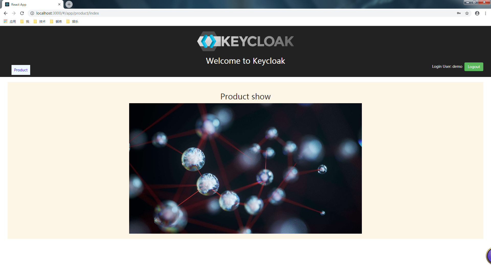
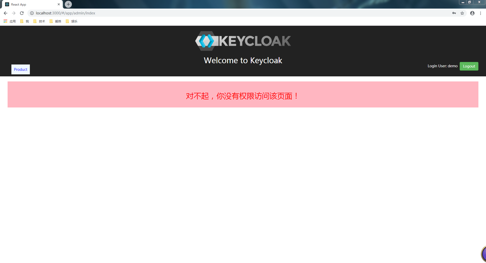
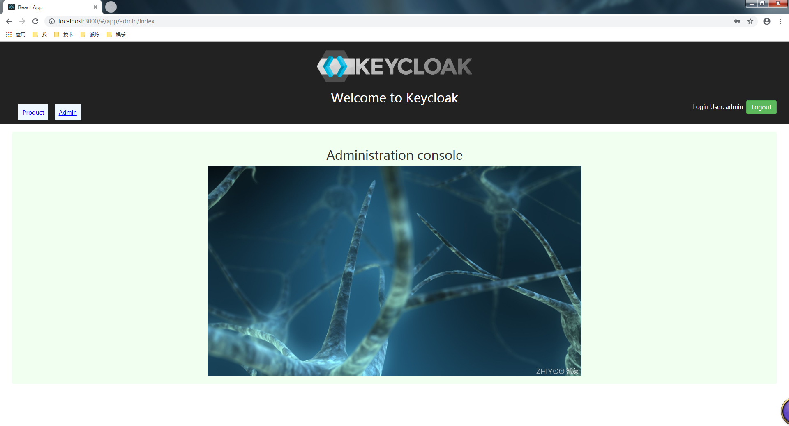
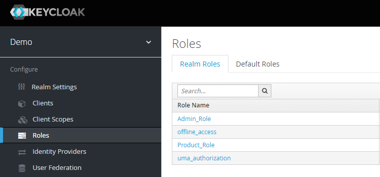
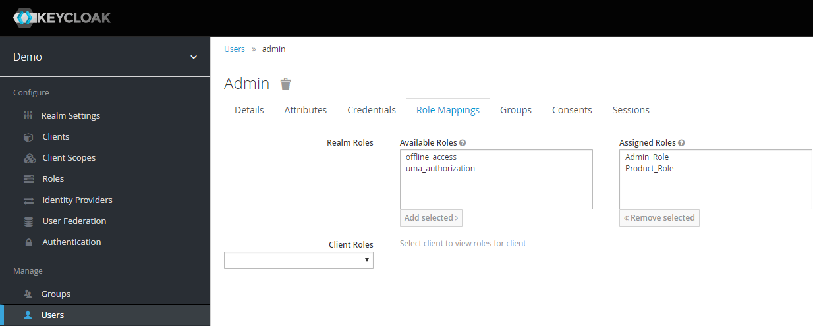

在上一篇《[Keycloak与React集成应用（上篇）：用户登录](http://www.yglong.com/keycloak-react-integration-01.html)》中，我们介绍了如何将keycloak集成到基于React的前端应用中，实现用户登录验证功能。本文将在上一篇实现的已有功能之上，继续实现用户访问控制的功能，演示如何使用keycloak轻松地对应用的访问进行控制。

### 基于角色的访问控制（RBAC）

`Keycloak`设计非常灵活，支持多种访问控制方式，其中最简单的方式是基于角色的访问控制。 

本文将演示这种最简单的，基于角色的访问控制。 

在上一篇已有的用户登录验证功能之上，我们进一步实现对登录用户的访问进行控制。例如某些用户只能访问应用的某些页面。 

我们将基于用户所分配的角色来限制用户可以访问的内容。 例如对于本应用，我们最终实现的效果描述如下：

-   用户`demo`只分配了访问product页面的角色（`Product_Role`），因此当使用`demo`用户登入应用后，菜单中只显示了`Product`菜单项，该用户只能访问product页面，如下图所示：



-   如果`demo`用户试图手动在浏览器地址栏中输入访问admin页面的url，将看到如下图所示的“对不起，你没有权限访问该页面！”的提示页面：



-   而当使用同时具有`Product_Role`和`Admin_Role`角色的`admin`用户登录应用后，将可以同时看到`Product`和`Admin`两个菜单项，并且两个页面都可以访问，如下图所示：



### 配置Keycloak

现在让我们来实现上述的访问控制功能吧。 

首先，我们需要在keycloak中创建用户及角色，并为每个用户分配适当的角色。 

在上一篇中我们已经创建了`demo`用户，现在我们再创建一个`admin`用户。 

然后创建角色。在Keycloak的`Administration Console`中，选择`demo`realm，选择左侧菜单中的`Roles`，点击`Add Role`按钮，分别创建两个角色：`Product_Role`和`Admin_Role`，创建后如下图所示： 

 

接着我们为创建的两个用户分配角色。 

选择菜单中的`Users`，点击`View all users`，将显示所有用户。 

选择某个用户，例如`admin`，然后选择`Role Mappings`选项卡，为用户分配角色。如下图所示，我们为`admin`用户同时分配了`Product_Role`和`Admin_Role`: 

 

同样的步骤，我们为`demo`用户只分配`Product_Role`，为了演示使用demo用户访问admin页面时，显示权限不足的提示页面。

### 在React应用中实现访问控制

接下来，让我们编写代码，在React应用中实现前面所演示的访问控制效果。

#### 创建访问控制配置文件

首先，我们在`public`下创建一个访问控制的配置文件`access_config.json`，内容如下：
```json
{
    "/app/product/index": ["Product_Role"],
    "/app/admin/index": ["Admin_Role"]
}
```

配置文件表明，访问product页面必须要有`Product_Role`角色，访问admin页面必须要有`Admin_Role`角色。当然我们也可以配置访问某个页面需要具有多个角色。

#### 加载配置文件，实现访问控制判断方法

我们再次回到上一篇创建的`src/keycloak.js`文件中，为`KeycloakClient`类实现两个新的方法：

-   加载访问控制配置文件的方法：`loadAccessConfig()`
-   判断是否可以访问某页面的方法： `isAccessable()`

首先，在`KeycloakClient`类中添加读取配置文件的方法：

```javascript
    loadAccessConfig = (configUrl) => {
        var req = new XMLHttpRequest();
        req.open('GET', configUrl, false);
        req.setRequestHeader('Accept', 'application/json');
        req.send();

        if (req.readyState === 4) {
            if (req.status === 200) {
                var config = JSON.parse(req.responseText);
                this.accessConfig = config
            }
        }
    }
```

**注意**：在方法中使用了同步Ajax请求下载配置文件。 我们需要在构造函数中调用上面的方法，使得在实例化`KeycloakClient`对象时加载配置文件：

```javascript
    constructor() {
        this.initialized = false
        
        this.keycloak = new Keycloak('/keycloak.json')

        this.accessConfig = {}

        this.loadAccessConfig('/access_config.json')
    }
```

接着，在`KeycloakClient`中添加判断是否可以访问某页面的方法：

```javascript
    isAccessable = (path) => {
        if (!this.accessConfig) {
            return false
        }
        let requiredRoles = this.accessConfig[path]
        if (!requiredRoles) {
            return true
        }
        let result = true
        for (var i in requiredRoles) {
            if (!this.keycloak.hasRealmRole(requiredRoles[i])) {
                result = false
                break
            }
        }
        return result
    }
```

该方法中，我们根据传入的访问路径，从加载的访问控制配置中查找访问该页面需要具有哪些角色，然后调用keycloak内置的`hasRealmRole()` 方法逐个判断该用户是否具有所要求的所有角色。一旦该用户没有某个要求的角色，就返回`false`，表示该用户没有访问该页面的权限。 

最后`src/keycloak.js`文件的完整代码如下：

```javascript
import Keycloak from 'keycloak-js'

class KeycloakClient {
    constructor() {
        this.initialized = false
        
        this.keycloak = new Keycloak('/keycloak.json')

        this.accessConfig = {}

        this.loadAccessConfig('/access_config.json')
    }

    init = (callback) => {
        this.keycloak.init({onLoad: "login-required"})
        .success(authenticated => {
            if (authenticated) {
                this.initialized = true
    
                callback(this.keycloak)
            }
        });
    }

    loadAccessConfig = (configUrl) => {
        var req = new XMLHttpRequest();
        req.open('GET', configUrl, false);
        req.setRequestHeader('Accept', 'application/json');
        req.send();

        if (req.readyState === 4) {
            if (req.status === 200) {
                var config = JSON.parse(req.responseText);
                this.accessConfig = config
            }
        }
    }

    isAccessable = (path) => {
        if (!this.accessConfig) {
            return false
        }
        let requiredRoles = this.accessConfig[path]
        if (!requiredRoles) {
            return true
        }
        let result = true
        for (var i in requiredRoles) {
            if (!this.keycloak.hasRealmRole(requiredRoles[i])) {
                result = false
                break
            }
        }
        return result
    }
}

const keycloakClient = new KeycloakClient()
export default keycloakClient
```

#### 实现权限不足提示页面

实现访问控制的核心方法已经实现了，接下来让我们在应用中使用它实现页面的访问控制。 

在这之前，由于我们需要在用户没有访问某页面的权限时，提示权限不足的页面。因此我们需要先实现一个显示权限不足的新页面。 

在`src/components`下新建一个`pages`目录，在其中新建一个`Denied.jsx`文件，我们在其中实现一个`Denied`的React组件，用于显示权限不足的信息，代码如下：

```javascript
import React, { Component } from 'react'

export default class Denied extends Component {
    
    render() {
        return (
            <div className="denied">
                <h2>对不起，你没有权限访问该页面！</h2>
            </div>
        )
    }
}
```

#### 修改路由，根据权限判断结果进行跳转

那么，当用户访问某页面时，如何实现根据判断结果实现不同的跳转呢？我们可以修改路由组件的行为来实现。 

让我们再次回到`src/routes/index.js`文件中。在上一篇中，我们创建了一个扩展路由组件`Route`的`PropsRoute`组件，它实现了将keycloak对象通过props传递到`Route`的目标组件中（即，component属性指定的组件）。 

我们可以在该扩展组件的基础之上进一步扩展，加入判断访问权限的逻辑。 

为了更好的说明组件的含义，我们更改了扩展组件的名字为`PrivateRoute` ，代码如下：

```javascript
const PrivateRoute = ({path: path, component: Component, ...rest}) => {
    return keycloakClient.isAccessable(path) ? (
        <Route 
            {...rest}
            render={props => (<Component {...rest} {...props}></Component>)}></Route>
    ) : (
        <Route 
            {...rest}
            render={props => (<Denied {...rest} {...props}></Denied>)}></Route>
    )
}
```

可以看到，我们调用了前面实现的`isAccessable()` 方法对传入的path进行判断，如果有权限，返回一个渲染目标组件的`Route`，如果没有权限，则返回渲染`Denied`组件的Route。 

然后，我们将路由组件的代码进行修改，使其使用新修改的`PrivateRoute`组件替代上一篇的`PropsRoute`组件。 

修改后的`src/routes/index.js`完整代码如下：

```javascript
import React, { Component } from 'react'
import { Switch, Route } from 'react-router-dom'
import ProductIndex from '../components/product/ProductIndex'
import AdminIndex from '../components/admin/AdminIndex'
import keycloakClient from '../keycloak'
import Denied from '../components/pages/Denied'

export default class MyRouter extends Component {

    render() {
        return (
            <Switch>
                {/* <Route exact path="/app/product/index" component={ProductIndex}></Route> */}
                {/* <Route exact path="/app/admin/index" component={AdminIndex}></Route> */}
                <PrivateRoute exact path="/app/product/index" component={ProductIndex} />
                <PrivateRoute exact path="/app/admin/index" component={AdminIndex} />
            </Switch>
        )
    }
}

const PrivateRoute = ({path: path, component: Component, ...rest}) => {
    return keycloakClient.isAccessable(path) ? (
        <Route 
            {...rest}
            render={props => (<Component {...rest} {...props}></Component>)}></Route>
    ) : (
        <Route 
            {...rest}
            render={props => (<Denied {...rest} {...props}></Denied>)}></Route>
    )
}
```

#### 根据权限判断结果显示不同菜单项

最后，我们在`src/App.js`中实现根据权限判断结果，显示不同的菜单项。最后达到只显示有权限访问的页面对应的菜单项。 

类似上面的扩展路由组件，我们创建一个扩展`Link`的组件`PrivateLink` 组件。代码如下：

```javascript
const PrivateLink = ({to: path, children, ...rest}) => {
  return keycloakClient.isAccessable(path) ? (
          <Link to={path} {...rest}>{children}</Link>
        ) : null
}
```

扩展组件中，同时使用了前面提供的`isAccessable()` 方法判断是否可以访问传入的path，如果可以访问，就返回Link组件。如果不可以访问，就返回空，从而不显示内容。 

然后，我们把`App`组件中的`Link`组件替换为新建的`PrivateLink` 扩展组件。 

最后`src/App.js`的完整代码如下：

```javascript
import React, { Component } from 'react';
import logo from './logo.png';
import './App.css';
import Routes from './routes'
import { Link } from 'react-router-dom'
import keycloakClient from './keycloak'

export default class App extends Component {

  getLoginUser() {
    let user = ""
    if (this.props.keycloak && this.props.keycloak.tokenParsed) {
      user = this.props.keycloak.tokenParsed.preferred_username
    }
    return user
  }

  onLogout() {
    if (this.props.keycloak) {
      this.props.keycloak.logout()
    }
  }

  render() {
    return (
      <div className="App">
        <div className="App-header">
          
          <h2>Welcome to Keycloak</h2>
          <div className="App-navi">
            {/* <Link to="/app/product/index" className="navi">Product</Link> */}
            {/* <Link to="/app/admin/index" className="navi">Admin</Link> */}
            <PrivateLink to="/app/product/index" className="navi">Product</PrivateLink>
            <PrivateLink to="/app/admin/index" className="navi">Admin</PrivateLink>
          </div>
          <div className="App-user-info">
            Login User: {this.getLoginUser()} &nbsp;
            <button onClick={this.onLogout.bind(this)} className="btn btn-success" >Logout</button>
          </div>
        </div>
        <div className="App-content">
          <Routes></Routes>
        </div>
      </div>
    );
  }
}

const PrivateLink = ({to: path, children, ...rest}) => {
  return keycloakClient.isAccessable(path) ? (
          <Link to={path} {...rest}>{children}</Link>
        ) : null
}
```

### 测试效果

至此，keycloak的配置，以及React中的代码已经全部实现，我们再次启动应用来看看效果吧：

```bash
npm start
```

如果一切顺利，你应该可以看到与本文开始所演示的完全相同的效果。

### 小结

本文介绍了使用`keycloak`实现基于角色的访问控制功能，这是`keycloak`提供的最简单的访问控制的方式。 

实际上，keycloak还提供了更细粒度的访问控制方式，如基于权限（`permission`）的访问控制，它结合了资源（`resource`），`scope`和`policy`，可以实现更细粒度的访问控制。这是Keycloak提供的授权服务（`Authorization Service`）的高级功能。我会在后续的文章中介绍此功能。 本文的完整代码请参考[这里](https://github.com/longyg/keycloak-react-example)。
