## 一、大数据概述

### 1. 什么是大数据

现如今，相信人人都听说过`大数据`这个词，它实在太火热了，因为我们目前正处于`大数据时代`。

大数据其实已经兴起很多年了，只是随着无处不在的传感器、无处不在的数据埋点，获取数据变得越来越容易、量越来越大、内容越来越多样化，使得现目前的大数据的“大”越来越大了。

那么什么是大数据？

大数据本身其实是一个抽象的概念，从一般意义上讲，`大数据`是指一种规模大到无法在`有限时间内`用常规软件工具对其进行获取、存储、管理和处理的`数据集合`。

### 2. 大数据的特性

大数据，虽然从字面上只体现了一个`大`，但实际上大数据除了数据体量大的特性外，还有其他特性。现目前，业界公认为大数据具有`4V`特性，分别是`Volume`（数据体量大）、`Velocity`（数据速度快）、`Variety`（数据类型多）和`Value`（数据价值密度低），如下图所示：

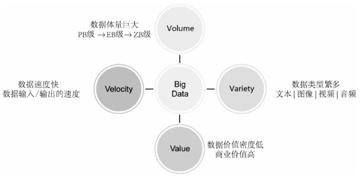

然而，随着大数据的不断发展，人们对大数据的了解和探索越来越深入，大数据技术也不断趋于成熟，人们提出了更多更具体的大数据特性，现目前已经从`4V`发展为`8V`特性，额外提出了`Veracity`（数据准确性），`Vitality`（数据动态性），`Visualization`（数据可视化），`Validity`（数据合法性），如下图所示：

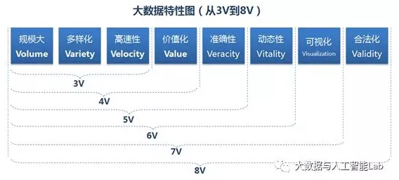

### 3. 大数据的发展历程分析

我们可以从几个维度来了解大数据的发展。

#### 3.1 从`信息化浪潮`的发展来看

过去几十年，人类经历了三次信息化浪潮，大数据正是从第三次信息化浪潮开始全面开启。

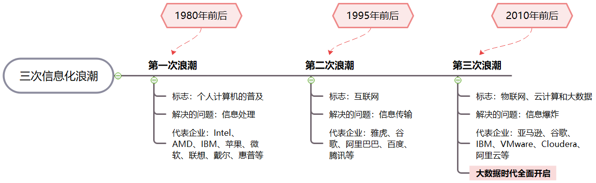

#### 3.2 从`信息科技`的发展来看

信息科技需要解决`信息存储`、`信息传输`和`信息处理`3个核心问题，人类社会在信息科技领域的不断进步，为大数据时代的到来提供了`技术支撑`。

主要包括如下图所示几个方面的发展：

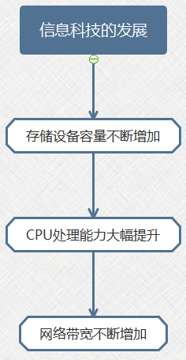

##### 存储设备容量不断增加

随着科学技术的不断进步，存储设备的制造工艺不断升级，容量大幅增加，速度不断提升，价格却在不断下降。

总体而言，数据量和存储设备容量二者之间是相辅相成、互相促进的。
- 一方面，随着数据的不断产生，需要存储的数据量不断增加，对存储设备的容量提出了更高的要求，促使存储设备生产商制造更大容量的产品满足市场需求；

- 另一方面，更大容量的存储设备进一步加快了数据量增长的速度，在存储设备价格高企的年代，由于考虑到成本问题，一些不必要或当前不能明显体现价值的数据往往会被丢弃。但是，随着单位存储空间价格的不断降低，人们开始倾向于把更多的数据保存起来，以期在未来某个时刻可以用更先进的数据分析工具从中挖掘价值。

##### CPU处理能力大幅提升

性能不断提升的CPU，大大提高了处理数据的能力，使得我们可以更快地处理不断累积的海量数据。

##### 网络带宽不断增加

进入21世纪，世界各国更是纷纷加大宽带网络建设力度，不断扩大网络覆盖范围和传输速度。大数据时代，信息传输不再遭遇网络发展初期的瓶颈和制约。

#### 3.3 从`数据产生方式`的发展来看

`数据产生方式`的变革，是促成大数据时代来临的重要因素。总体而言，人类社会的数据产生方式大致经历了3个阶段：`运营式系统阶段`、`用户原创内容阶段`和`感知式系统阶段`，如下图所示：

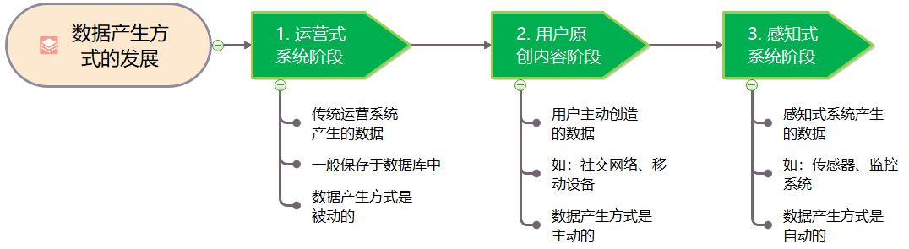

现如今，因为发展到感知式系统阶段，大量数据自动产生，数据量呈爆发式增长，使得人类社会真正步入`大数据时代`。

### 4. 大数据的发展历程回顾

前面从多维度分析了大数据的发展，而从时间维度上看，大数据的发展历程可以划分为4个重要阶段：`萌芽阶段`，`突破阶段`，`成熟阶段`，`应用阶段`。

如下图所示：

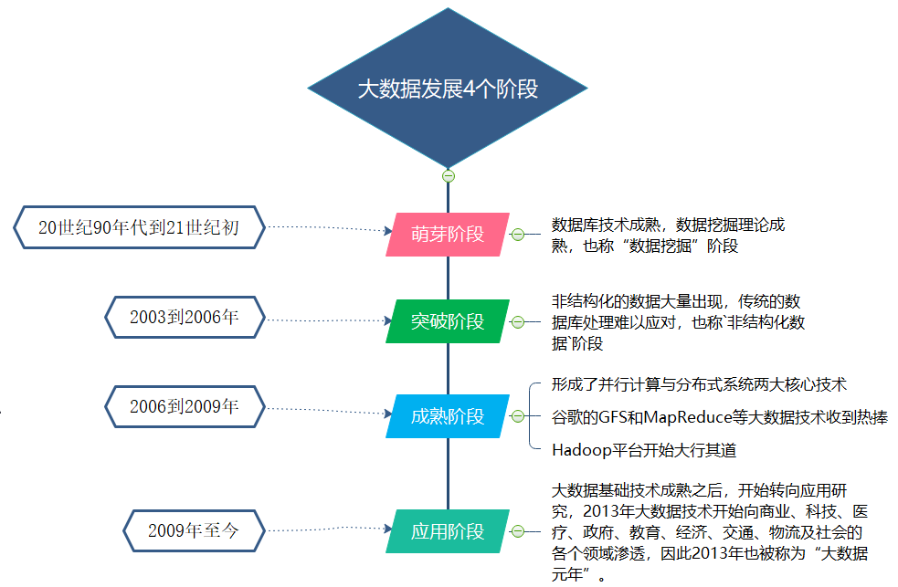

更详细的大数据发展历程如下图所示：

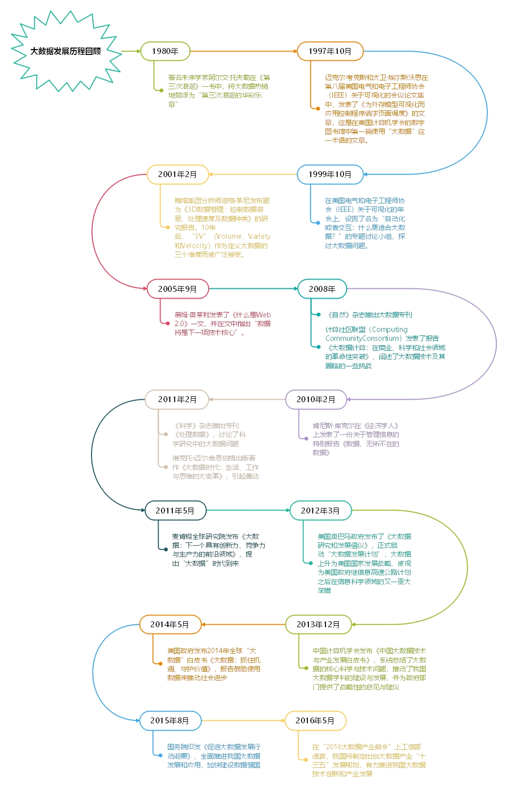

### 5. 大数据的作用

大数据虽然孕育于信息通信技术，但它对社会、经济、生活产生的影响绝不限于技术层面。更本质上，它是为我们看待世界提供了一种全新的方法，即决策行为将日益基于数据分析，而不是像过去更多凭借经验和直觉。

具体来讲，大数据将有以下几个方面的作用：

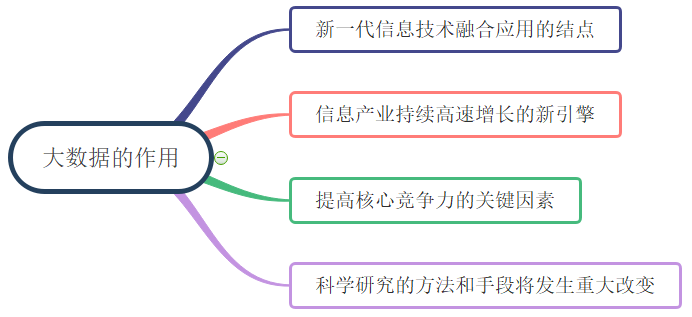

### 6. 大数据的影响

大数据对`科学研究`、`思维方式`和`社会发展`等方面都具有重要而深远的影响，如：

- 在科学研究方面
大数据使得人类科学研究在经历了实验、理论、计算3种范式之后，迎来了`第四种范式`——数据密集型科学。

- 在思维方式方面
大数据具有`全样而非抽样`、`效率而非精确`、`相关而非因果`三大显著特征，完全颠覆了传统的思维方式。

- 在社会发展方面
`大数据决策`逐渐成为一种新的决策方式，大数据应用有力促进了信息技术与各行业的深度融合，大数据开发大大推动了新技术和新应用的不断涌现。

- 在就业市场方面
大数据的兴起使得`数据科学家`成为热门人才。

- 在人才培养方面
大数据的兴起将在很大程度上改变我国高校信息技术相关专业的现有教学和科研体制。

总体来讲，大数据时代的到来改变了人们的生活方式、思维模式和研究范式，我们可以总结出10个重大变化，如下图所示：

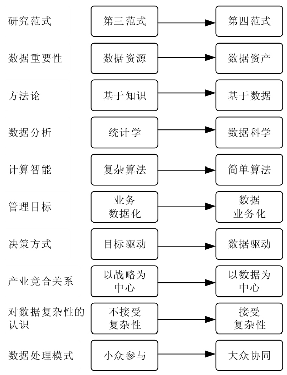

### 7. 大数据的发展现状与趋势

#### 7.1 大数据的现状

目前，大数据应用已经比较广泛，在各个领域均有应用，且在各个领域的应用均初见成效，如下图所举示例：

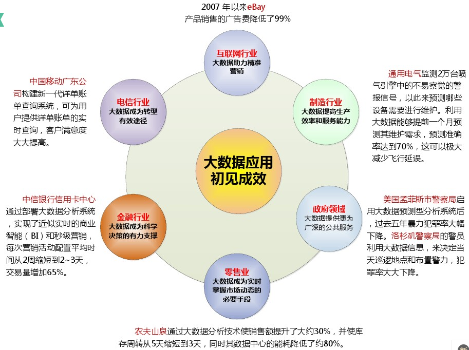

#### 7.2 大数据的未来与趋势

虽然大数据已经得到广泛应用，但大部分尚处于初级阶段。现目前，各大IT巨头正在纷纷布局大数据。在全球范围内，研究发展大数据技术、运用大数据推动经济发展、完善社会治理、提升政府服务和监管能力正成为趋势。包括以下三个方面：

1. 已有众多成功的大数据应用，但就其效果和深度而言，当前大数据应用尚处于初级阶段，根据大数据`分析预测未来`、`指导实践`的深层次应用将成为发展重点。

2. 大数据`治理体系`远未形成，特别是隐私保护、数据安全与数据共享利用效率之间尚存在明显矛盾，成为制约大数据发展的重要短板，各界已经意识到构建大数据治理体系的重要意义，相关的研究与实践将持续加强。

3. 数据规模高速增长，现有技术体系难以满足大数据应用的需求，大数据理论与技术远未成熟，未来信息技术体系将需要颠覆式创新和变革。

## 二、大数据技术概述

### 1. 什么是大数据技术

`大数据技术`，一般意义来说，是指从各种各样的巨量数据中，快速获取有价值信息的技术。

具体而言，是指伴随着大数据的`采集`、`存储`、`分析`和`应用`的相关技术，是一系列使用非传统的工具来对大量的结构化、半结构化和非结构化数据进行处理，从而获得分析和预测结果的一系列数据处理和分析技术。

一般来说，对于大数据的处理，包含`数据抽取与集成`、`数据分析`和`数据解释`三个基本流程，而大数据技术就是解决这些流程中的问题的相关技术。

### 2. 大数据关键技术

大数据本身是一种现象而不是一种技术。`大数据技术`是一系列使用非传统的工具来对大量的结构化、半结构化和非结构化数据进行处理，从而获得分析和预测结果的数据处理技术。大数据价值的完整体现需要多种技术的协同。大数据关键技术涵盖数据存储、处理、应用等多方面的技术。

根据大数据的处理过程，可将大数据关键技术分为`大数据采集技术`，`大数据预处理技术`，`大数据存储与管理技术`，`大数据处理技术`，`大数据分析与挖掘技术`，`大数据展示技术`等。

概括总结如下图所示：

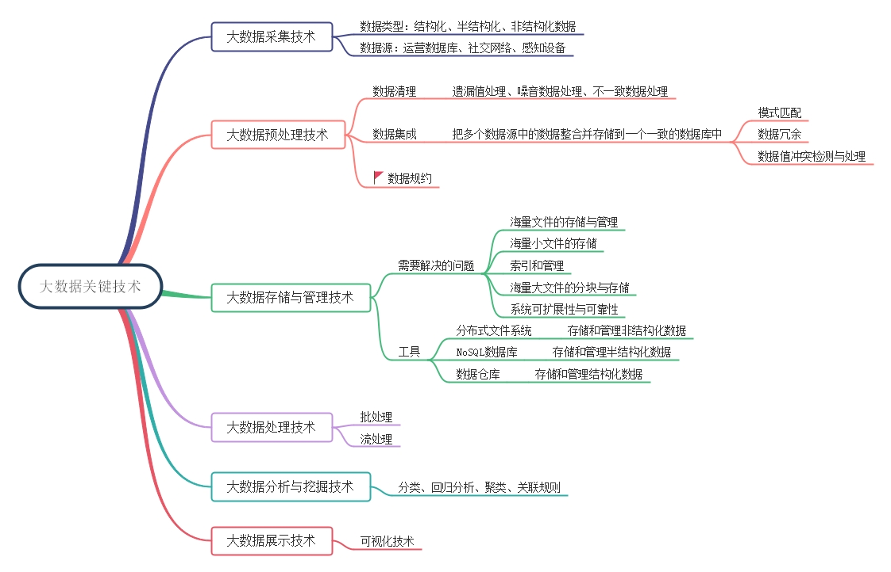

### 3. 大数据技术体系

前面介绍了大数据的基本处理流程和相关的关键技术，当我们在设计一个大数据系统时，都会涉及到这些数据处理的各个环节以及相应的技术。

对于一个完整的大数据系统，在设计其技术体系架构时，一般需要考虑6个主要层次：`数据收集曾`，`数据存储层`，`资源管理与服务协调层`，`计算引擎层`，`数据分析层`，`数据可视化层`。

如下图所示：

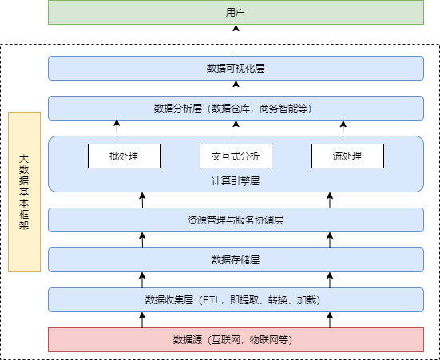

#### 数据收集层

数据源一般特点:

- `分布式`：分布在不同机器或设备上，通过网络连接在一起。
- `异构性`：任何能产生数据的系统均可以称为数据源，如手环，传感器，视频摄像头等。
- `多样化`：关系型（用户基本信息）和非关系型（图片，音频，视频等）。
- `流式产生`：数据源如同“水龙头”，源源不断。收集系统应实时或近实时将数据发送到后端，以便对数据进行及时分析。

适用大数据领域的收集系统一般具备特性:

- `扩展性`：适配不同数据源，并能接入大量数据源而不会产生系统瓶颈。
- `可靠性`：数据不丢失
- `安全性`：敏感数据处理机制
- `低延性`：保证较低延迟前提将数据传输到后端系统

#### 数据存储层

大数据存储系统一般要求具备特性：

- `扩展性`：存储能力扩展
- `容错性`：考虑成本等因素，大数据系统从最初假设构建在廉价机器上，要求系统本身就有良好的容错机制确保在机器出现故障时不会导致丢失数据。
- `存储模型`：支持多种数据模型

#### 资源管理与服务协调层

传统的"一个应用一个集群"缺点：资源利用率低，运维成本高，从而引入数据共享轻量级弹性资源管理平台，资源统一管理层好处：

- `资源利用率高`：共享集群模式通过多种应用共享资源，使得集群中资源得到充分利用。
- `运维成本低`：需要少数管理员即可完成多个框架的统一管理。
- `数据共享`：共享集群模式解决跨集群间的数据移动不仅需要花费更长的时间，且硬件成本也大大增加问题。

#### 计算引擎层

针对不同应用场景，单独构建一个计算机引擎，每种计算引擎只专注于解决某一类问题。

- `批处理`：对实时要求低，追求高吞吐量，比如搜索引擎建索引，数据挖掘，机器学习等。
- `交互式处理`：对时间要求较高，秒级别。需要跟人进行交互，如应用数据查询，参数化报表，OLAP等。
- `实时处理`：对时间要求最高，延迟在秒级内，如广告系统，舆情监测等。

#### 数据分析层

该层直接跟用户应用程序对接，提供易用的数据处理工具。一般结合工具使用，使用处理框架对原始海量数据进行分析，产生较小规模的数据集，在此基础上，再使用交互式处理工具对数据集进行快速查询，获取查询结果。

#### 数据可视层

运用计算机图形学和图像处理技术，将数据转换为图形或图像在屏幕上显示出来，并进行交互式的理论，方法和技术。

### 4. 大数据技术体系对应的技术框架

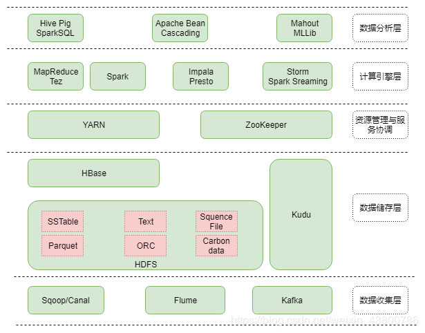

> 本文内容整理至网络。
> 
> 参考资料如下：
> - 《大数据导论：思维、技术与应用》
> - 《大数据技术原理与应用》（第2版）
> - 《大数据技术体系详解：原理、架构与实践》
> - [大数据发展现状和趋势](https://wenku.baidu.com/view/52602eb65122aaea998fcc22bcd126fff6055d6b.html)
> - [大数据：发展现状与未来趋势](http://www.npc.gov.cn/npc/c30834/201910/653fc6300310412f841c90972528be67.shtml)
> - [大数据发展历史](https://blog.csdn.net/cincoutcin/article/details/80586050)
> - [大数据的特性究竟有多少个V](https://blog.csdn.net/implok/article/details/79932798)