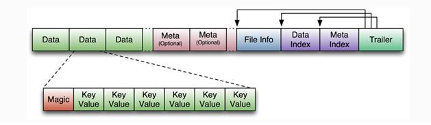

### HBase简介

HBase是一个开源的非关系型分布式数据库，它参考了谷歌的BigTable建模，实现的编程语言为Java。它是Apache软件基金会的Hadoop项目的一部分，运行于HDFS文件系统之上，为 Hadoop 提供类似于BigTable 规模的服务。因此，它可以容错地存储海量稀疏的数据。

HBase是一个高可靠、高性能、**面向列**、可伸缩的分布式数据库，是谷歌BigTable的开源实现，主要用来存储非结构化和半结构化的松散数据。HBase的目标是处理非常庞大的表，可以通过水平扩展的方式，利用廉价计算机集群处理由超过10亿行数据和数百万列元素组成的数据表。

#### 优点

HBase的优点与其他数据库相比，HBase在系统设计以及实际实践中有很多独特的优点。

- 容量巨大：HBase的单表可以支持千亿行、百万列的数据规模，数据容量可以达到TB甚至PB级别。传统的关系型数据库，如Oracle和MySQL等，如果单表记录条数超过亿行，读写性能都会急剧下降，在HBase中并不会出现这样的问题。
- 良好的可扩展性：HBase集群可以非常方便地实现集群容量扩展，主要包括数据存储节点扩展以及读写服务节点扩展。HBase底层数据存储依赖于HDFS系统，HDFS可以通过简单地增加DataNode实现扩展，HBase读写服务节点也一样，可以通过简单的增加RegionServer节点实现计算层的扩展。
- 稀疏性：HBase支持大量稀疏存储，即允许大量列值为空，并不占用任何存储空间。这与传统数据库不同，传统数据库对于空值的处理要占用一定的存储空间，这会造成一定程度的存储空间浪费。因此可以使用HBase存储多至上百万列的数据，即使表中存在大量的空值，也不需要任何额外空间。
- 高性能：HBase目前主要擅长于OLTP场景，数据写操作性能强劲，对于随机单点读以及小范围的扫描读，其性能也能够得到保证。对于大范围的扫描读可以使用MapReduce提供的API，以便实现更高效的并行扫描。
- 多版本：HBase支持多版本特性，即一个KV可以同时保留多个版本，用户可以根据需要选择最新版本或者某个历史版本。
- 支持过期：HBase支持TTL过期特性，用户只需要设置过期时间，超过TTL的数据就会被自动清理，不需要用户写程序手动删除。
- Hadoop原生支持：HBase是Hadoop生态中的核心成员之一，很多生态组件都可以与其直接对接。HBase数据存储依赖于HDFS，这样的架构可以带来很多好处，比如用户可以直接绕过HBase系统操作HDFS文件，高效地完成数据扫描或者数据导入工作；再比如可以利用HDFS提供的多级存储特性（Archival Storage Feature），根据业务的重要程度将HBase进行分级存储，重要的业务放到SSD，不重要的业务放到HDD。或者用户可以设置归档时间，进而将最近的数据放在SSD，将归档数据文件放在HDD。另外，HBase对MapReduce的支持也已经有了很多案例，后续还会针对Spark做更多的工作。

#### 缺点

任何一个系统都不会完美，HBase也一样。HBase不能适用于所有应用场景，例如：

- HBase本身不支持很复杂的聚合运算（如Join、GroupBy等）。如果业务中需要使用聚合运算，可以在HBase之上架设Phoenix组件或者Spark组件，前者主要应用于小规模聚合的OLTP场景，后者应用于大规模聚合的OLAP场景。
- HBase本身并没有实现二级索引功能，所以不支持二级索引查找。好在针对HBase实现的第三方二级索引方案非常丰富，比如目前比较普遍的使用Phoenix提供的二级索引功能。
- HBase原生不支持全局跨行事务，只支持单行事务模型。同样，可以使用Phoenix提供的全局事务模型组件来弥补HBase的这个缺陷。

可以看到，HBase系统本身虽然不擅长某些工作领域，但是借助于Hadoop强大的生态圈，用户只需要在其上架设Phoenix组件、Spark组件或者其他第三方组件，就可以有效地协同工作。

### HBase中用的数据结构与算法

#### 跳跃表

HBase把跳跃表作为一种维护有序数据集合的基础数据结构。


#### LSM树


HBase中的应用：


#### 布隆过滤器


布隆过滤器串对任意给定元素w，给出的存在性结果为两种：

- w可能存在于集合A中。
- w肯定不在集合A中。

HBase的Get操作就是通过运用低成本高效率的布隆过滤器来过滤大量无效数据块的，从而节省大量磁盘IO。

### HBase数据模型

**列族（列簇）式的存储**

**列族的存储概念：**多个数据列的组合，hbase表中的每个列都归属于某个列族。列族是表的schema的一部分，而列不是，我们在创建一张hbase表的时候，必须要给出列族的名称，但不需要给出列的名称。列名一般都以列族名称作为前缀，访问控制、磁盘、内存的使用统计都是在列族层面进行的，hbase准确的说是列族数据库，而不是列数据库。

**逻辑视图**

从逻辑视图来看，HBase中的数据是以表形式进行组织的，而且和关系型数据库中的表一样，HBase中的表也由行和列构成。


另外，每个cell都可以保存多个版本的数据，如下：


需要注意的是，与关系型数据库不同的是：

- HBase引入了列簇的概念，列簇下的列可以动态扩展；
- 另外，HBase使用时间戳实现了数据的多版本支持。

**物理视图**

从物理视图来看，HBase是一个Map，由键值（KeyValue，KV）构成，不过与普通的Map不同，HBase是一个稀疏的、分布式的、多维排序的Map。要真正理解HBase的工作原理，需要从KV数据库这个视角重新对其审视。

BigTable论文中称BigTable为"sparse, distributed, persistent multidimensional sortedmap"，可见BigTable本质上是一个Map结构数据库，HBase亦然，也是由一系列KV构成的。然而HBase这个Map系统却并不简单，有很多限定词——稀疏的、分布式的、持久性的、多维的以及排序的。

HBase中Map的key是一个复合键，由rowkey、column family、qualif ier、type以及timestamp组成，value即为cell的值：

```
[Row Key, Column Family, Column Qualifier, Timestamp, Key Type] => value
```

KV在内存中是一个字节数组，格式如下：

KeyValue的整体结构为：
[`key length`, `value length`, `key`, `value`]
而Key的结构为：
[`row length`, `row key`, `column family length`, `column family`, `column qualifier`, `timestamp`, `key type`]


HBase中的数据是按照列簇存储的，即将数据按照列簇分别存储在不同的目录中。

逻辑视图与物理视图映射：


- 多维：这个特性比较容易理解。HBase中的Map与普通Map最大的不同在于，key是一个复合数据结构，由多维元素构成，包括rowkey、column family、qualif ier、type以及timestamp。

- 稀疏：稀疏性是HBase一个突出特点。从表中行"com.example.www"可以看出，整整一行仅有一列（people:author）有值，其他列都为空值。在其他数据库中，对于空值的处理一般都会填充null，而对于HBase，空值不需要任何填充。这个特性为什么重要？因为HBase的列在理论上是允许无限扩展的，对于成百万列的表来说，通常都会存在大量的空值，如果使用填充null的策略，势必会造成大量空间的浪费。因此稀疏性是HBase的列可以无限扩展的一个重要条件。

- 排序：构成HBase的KV在同一个文件中都是有序的，但规则并不是仅仅按照rowkey排序，而是按照KV中的key进行排序——先比较rowkey，rowkey小的排在前面；如果rowkey相同，再比较column，即column family:qualif ier，column小的排在前面；如果column还相同，再比较时间戳timestamp，即版本信息，timestamp大的排在前面。这样的多维元素排序规则对于提升HBase的读取性能至关重要，在后面读取章节会详细分析。

- 分布式：很容易理解，构成HBase的所有Map并不集中在某台机器上，而是分布在整个集群中。

**HBase数据存储目录**

我们在搭建HBase时，需要指定其数据存储目录，HBase会在指定的目录中构造需要的目录结构，之后我们创建数据表以及存放数据时，也会存放在对应的目录中，我们下面就介绍下，hbase数据存储目录结构。

```xml
<property>
    <name>hbase.rootdir</name>
    <value>hdfs://hdcluster/hbase</value>
</property>
```


**.tmp:**当对表做创建或删除操作时，会将表移动到.tmp目录下面，然后再去做处理操作他是一个临时交换的表目录，临时存放一些当前需要修改的数据结构。

**WALs:**它其实是一个预写日志，它是被HLog实例管理的WAL文件，这里可以简单的理解为hbase数据库系统的操作日志文件。

**archive:**它存储表的归档和快照，hbase在做分隔或者是合并操作完成之后，会将hfile文件移动到archive目录中，然后将之前的hfile删除掉。这个目录是有master中的定时任务定期去处理。

**corrupt:**这个目录用于存放损坏的日志文件，他一般是空的，如果他不为空代表我们的系统出现了些问题，有些日志文件可能被损坏了。

**data:**它是hbase存储数据的核心目录，系统表和用户表数据都存储在这里，他是非常重要的目录

**hbase.id:**hbase在运行起来之后，就会产生集群中的唯一id，是用来标识hbase进程用的。

**hbase.version:**它表明了hbase的文件格式、版本信息，其实就是表明了hfile的文件版本信息。

**oldWALs:**当WALs中的log文件被持久化后，日志就不被需要了，就会被移动到oldWALs目录中等待删除。

**HBase的元信息表**

hbase:meta


**Row Key：**其实Meta Table也是一个普通的hbase数据表，他的结构跟普通的表结构是差不多的。不过他的Row Key和Value有特殊意义：Row Key它包含三个部分，对三个部分进行组合得到一个Row Key，其中table为region table、region Start key、以及region Time，这里的time为存储数据的最早时间。由于Mata Table中包含Start key，所以它很容易找到对应的region，最后找到对应的数据。

**Value：**value最终指向的是Region Server，它其实保存的是Region Server的地址。表中最主要的列族是info，列族中包含三个主要的列，都是属于value的，三个属性列中第一个属性列是regioninfo，第二个属性列是server，包含了Region Server的服务器地址和端口，第三个属性列是Start code，它包含了Region Server的start time。

### HBase架构


#### 角色

**Client**

1. 使用HBase的RPC机制与HMaster和HRegionServer进行通信。
2. 对于管理类操作，Client与HMaster进行RPC通信。
3. 对于数据读写类操作，Client与HRegionServer进行RPC。

**主节点HMaster**

1. 管理HRegionServer，实现其负载均衡。
2. 管理和分配HRegion，比如在HRegion拆分时分配新的HRegion；在HRegionServer退出时迁移其内的HRegion到其他HRegionServer上。
3. 监控集群中所有HRegionServer的状态(通过Heartbeat和监听ZooKeeper中的状态)。
4. 处理Schema更新请求 (创建、删除、修改Table的定义等）。
5. HMaster没有单点问题，在Hbase中可以启动多个HMaster，通过Zookeeper的Master Election机制保证总有一个Master胜出。

**HRegionServer**

1. HRegionServer维护HMaster分配给它的region，处理这些Region的IO请求。
2. HRegionServer负责切分在运行过程中变得过大的Region。

**ZooKeeper**

1. 通过选举，保证任何时候，集群中只有一个HMaster，HMaster与HRegionServer启动时会向ZooKeeper注册。
2. 实时监控HRegionServer的上线和下线信息，并实时通知给HMaster。
3. 存贮所有Region的寻址入口和HBase的Schema和Table元数据。
4. Zookeeper的引入实现HMaster主从节点的failover。

#### RegionServer

RegionServer是HBase中最重要的角色，它包含很多组件，因此有必要单独对其加以说明。


##### Region

Region是HBase中数据表的一个数据分片，一个RegionServer上通常会负责多个Region的数据读写。一个Region由多个Store组成，每个Store存放对应列簇的数据，比如一个表中有两个列簇，这个表的所有Region就都会包含两个Store。

##### Store

每个Store包含一个MemStore和多个HFile，用户数据写入时会将对应列簇数据写入相应的MemStore，一旦写入数据的内存大小超过设定阈值，系统就会将MemStore中的数据落盘形成HFile文件

##### HLog

HLog预写日志文件，每次写入请求到来时，会先写入HLog，然后写入MemStore。

##### MemStore

MemStore是HBase的写缓存，所有写入请求都会先写入MemStore。

##### HFile

HFile是当MemStore中的数据达到阈值时刷写到HDFS中的文件。

HBase中KeyValue数据的存储格式，是Hadoop的二进制格式文件。 首先HFile文件是不定长的，长度固定的只有其中的两块：Trailer和FileInfo。

Trailer中有指针指向其他数据块的起始点，FileInfo记录了文件的一些meta信息。Data Block是HBase IO的基本单元，为了提高效率，

HRegionServer中有基于LRU的Block Cache机制。每个Data块的大小可以在创建一个Table的时候通过参数指定（默认块大小64KB），

大号的Block有利于顺序Scan，小号的Block利于随机查询。每个Data块除了开头的Magic以外就是一个个KeyValue对拼接而成，

Magic内容就是一些随机数字，目的是防止数据损坏，结构如下。


HFile结构图如下：



Data Block段用来保存表中的数据，这部分可以被压缩。 Meta Block段（可选的）用来保存用户自定义的kv段，可以被压缩。 FileInfo段用来保存HFile的元信息，不能被压缩，用户也可以在这一部分添加自己的元信息。 Data Block Index段（可选的）用来保存Meta Blcok的索引。 Trailer这一段是定长的。保存了每一段的偏移量，读取一个HFile时，会首先读取Trailer，Trailer保存了每个段的起始位置(段的Magic Number用来做安全check)，然后，DataBlock Index会被读取到内存中，这样，当检索某个key时，不需要扫描整个HFile，而只需从内存中找到key所在的block，通过一次磁盘io将整个 block读取到内存中，再找到需要的key。DataBlock Index采用LRU机制淘汰。 HFile的Data Block，Meta Block通常采用压缩方式存储，压缩之后可以大大减少网络IO和磁盘IO，随之而来的开销当然是需要花费cpu进行压缩和解压缩。（备注： DataBlock Index的缺陷。 a) 占用过多内存　b) 启动加载时间缓慢）

查看HFile：

```shell
hbase hfile
```

##### BlockCache

BlockCache是HBase的读缓存，HBase会将读取过的数据缓存到BlockCache中，后续再次读取同样的数据时，会直接从该缓存中读取并返回。

### 数据读写流程


#### 第一次读写

当客户端第一次读或写时，需要做如下两个步骤

1. 从Zookeepr中获取meta表的region所在的RegionServer
2. 从meta表的region所在的RegionServer上获取meta表内容，解析出要读或写的表的region所在的RegionServer。

当获取到要读写的表的region所在的RegionServer后，就会实际的往这个RegionServer发起读或写的请求。

上面两个过程一般只有第一次读或写时才会进行，因为客户端会缓存这两个步骤获取到的信息，不需要每次都执行这两个步骤。只有缓存中没有时才会执行。


#### 写流程

下图展示了一个完整的写流程，包括了从Zookeeper获取meta表信息的步骤。


**MemStore Flush**

从上面的写入流程可以看到，写入MemStore成功后，就会立刻返回客户端。因此HBase的写入是非常快的，因为只需要写入内存成功后就返回了。

但是当写入到MemStore的数据达到阈值后，HBase就会在后台自动启动刷写线程，将内存中的数据flush到HDFS中。


#### 读流程

下图展示了一个完整的读流程，包括了从Zookeeper获取meta表信息的步骤。


#### HFile Compaction

由于memstore 每次刷写都会生成一个新的HFile，且同一个字段的不同版本（timestamp）和不同类型（Put/Delete）有可能会分布在不同的HFile 中，因此查询时需要遍历所有的HFile。

为了减少HFile 的个数，以及清理掉过期和删除的数据，会进行StoreFile Compaction。

Compaction 分为两种，分别是Minor Compaction 和Major Compaction。

- Minor Compaction会将临近的若干个较小的HFile 合并成一个较大的HFile，但不会清理过期和删除的数据。
- Major Compaction 会将一个Store 下的所有的HFile 合并成一个大HFile，并且会清理掉过期和删除的数据。


#### Region分裂


### HBase集群安装

省略，参见官方文档。

### HBase使用

#### HBase shell命令

创建表

```shell
create 'student', 'info', 'basic', 'note'
```

创建表时指定最大版本数

```shell
create 'student', {NAME=>'info', VERSIONS=>3}, {NAME=>'basic',VERSIONS=>4}, 'note'
```

查看表

```shell
describe 'student'
```

输出：

```shell
Table student is ENABLED
student
COLUMN FAMILIES DESCRIPTION
{NAME => 'basic', VERSIONS => '4', EVICT_BLOCKS_ON_CLOSE => 'false', NEW_VERSION_BEHAVIOR => 'false', KEEP_DELETED_CELLS => 'FALSE', CACHE_DATA_ON_WRITE => 'false', DATA_BLOCK_ENCODING => 'NONE', TTL =>
'FOREVER', MIN_VERSIONS => '0', REPLICATION_SCOPE => '0', BLOOMFILTER => 'ROW', CACHE_INDEX_ON_WRITE => 'false', IN_MEMORY => 'false', CACHE_BLOOMS_ON_WRITE => 'false', PREFETCH_BLOCKS_ON_OPEN => 'false'
, COMPRESSION => 'NONE', BLOCKCACHE => 'true', BLOCKSIZE => '65536'}

{NAME => 'info', VERSIONS => '3', EVICT_BLOCKS_ON_CLOSE => 'false', NEW_VERSION_BEHAVIOR => 'false', KEEP_DELETED_CELLS => 'FALSE', CACHE_DATA_ON_WRITE => 'false', DATA_BLOCK_ENCODING => 'NONE', TTL => '
FOREVER', MIN_VERSIONS => '0', REPLICATION_SCOPE => '0', BLOOMFILTER => 'ROW', CACHE_INDEX_ON_WRITE => 'false', IN_MEMORY => 'false', CACHE_BLOOMS_ON_WRITE => 'false', PREFETCH_BLOCKS_ON_OPEN => 'false',
 COMPRESSION => 'NONE', BLOCKCACHE => 'true', BLOCKSIZE => '65536'}

{NAME => 'note', VERSIONS => '1', EVICT_BLOCKS_ON_CLOSE => 'false', NEW_VERSION_BEHAVIOR => 'false', KEEP_DELETED_CELLS => 'FALSE', CACHE_DATA_ON_WRITE => 'false', DATA_BLOCK_ENCODING => 'NONE', TTL => '
FOREVER', MIN_VERSIONS => '0', REPLICATION_SCOPE => '0', BLOOMFILTER => 'ROW', CACHE_INDEX_ON_WRITE => 'false', IN_MEMORY => 'false', CACHE_BLOOMS_ON_WRITE => 'false', PREFETCH_BLOCKS_ON_OPEN => 'false',
 COMPRESSION => 'NONE', BLOCKCACHE => 'true', BLOCKSIZE => '65536'}
```

修改表

```shell
alter 'student', {NAME=>'note',VERSIONS=>3}
```

插入数据

```shell
put 'student', '10001', 'info:name', 'Nick'
put 'student', '10001', 'info:age', '18'
put 'student', '10002', 'info:name', 'Janna'
put 'student', '10002', 'info:sex', 'Female'
```

扫描表

```shell
scan 'student'
```

输出:

```shell
ROW                                                 COLUMN+CELL
 10001                                              column=info:age, timestamp=1598411187429, value=18
 10001                                              column=info:name, timestamp=1598411166648, value=Nick
 10002                                              column=info:age, timestamp=1598411210147, value=20
 10002                                              column=info:name, timestamp=1598411221767, value=Janna
 10002                                              column=info:sex, timestamp=1598411232969, value=Female
2 row(s)
Took 0.0323 seconds
```

根据RowKey范围扫描表

```shell
scan 'student', {STARTROW=>'10001', STOPROW=>'10003'}
```

根据RowKey获取数据

```shell
get 'student', '10001'
```

输出：

```shell
COLUMN                                              CELL
 info:age                                           timestamp=1598411187429, value=18
 info:name                                          timestamp=1598411166648, value=Nick
1 row(s)
Took 0.0159 seconds
```

获取指定列

```shell
get 'student', '10002', 'info:name', 'info:sex', 'info:age'
```

获取指定列，指定版本数

```shell
get 'student', '10002', {COLUMN=>'info:name', VERSIONS=>3}, {COLUMN=>'info:sex', VERSIONS=>4}
```

修改数据

```shell
put 'student', '10001', 'info:age', '20'
put 'student', '10001', 'info:age', '21'
put 'student', '10001', 'info:age', '22'
```

扫描表多个版本

```shell
scan 'student', {VERSIONS=>4}
```

输出：

```shell
ROW                                                 COLUMN+CELL
 10001                                              column=info:age, timestamp=1598411633187, value=22
 10001                                              column=info:age, timestamp=1598411613453, value=21
 10001                                              column=info:age, timestamp=1598411607396, value=20
 10001                                              column=info:name, timestamp=1598411166648, value=Nick
 10002                                              column=info:name, timestamp=1598411221767, value=Janna
 10002                                              column=info:sex, timestamp=1598411232969, value=Female
2 row(s)
Took 0.0092 seconds
```

扫描表指定字段

```shell
scan 'student', {COLUMN=>'info:age'}
```

输出：

```shell
ROW                                                 COLUMN+CELL
 10001                                              column=info:age, timestamp=1598411633187, value=22
1 row(s)
Took 0.0051 seconds
```

扫描指定字段多个版本

```shell
scan 'student', {COLUMN=>'info:age',VERSIONS=>4}
```

输出：

```shell
ROW                                                 COLUMN+CELL
 10001                                              column=info:age, timestamp=1598411633187, value=22
 10001                                              column=info:age, timestamp=1598411613453, value=21
 10001                                              column=info:age, timestamp=1598411607396, value=20
1 row(s)
Took 0.0122 seconds
```

扫描所有历史记录

（不能指定列）

```shell
scan 'student', {VERSIONS=>10, RAW=>true}
```

输出：

```shell
ROW                                                 COLUMN+CELL
 10001                                              column=info:age, timestamp=1598412175177, value=25
 10001                                              column=info:age, timestamp=1598411633187, value=22
 10001                                              column=info:age, timestamp=1598411613453, value=21
 10001                                              column=info:age, timestamp=1598411607396, value=20
 10001                                              column=info:age, timestamp=1598411187429, value=18
 10001                                              column=info:name, timestamp=1598411166648, value=Nick
 10002                                              column=info:age, timestamp=1598411210147, type=Delete
 10002                                              column=info:age, timestamp=1598411210147, value=20
 10002                                              column=info:name, timestamp=1598411221767, value=Janna
 10002                                              column=info:sex, timestamp=1598411232969, value=Female
2 row(s)
Took 0.0097 seconds
```

删除数据

```shell
delete 'student', '10001', 'info:age'
```

默认是删除最新时间戳的数据

也可以指定删除某时间戳的数据，如下，删除了21

```shell
delete 'student', '10001', 'info:age', 1598411613453
```

再次查看

```shell
scan 'student', {COLUMN=>'info:age',VERSIONS=>10}
```

输出：

```shell
ROW                                                 COLUMN+CELL
 10001                                              column=info:age, timestamp=1598411633187, value=22
 10001                                              column=info:age, timestamp=1598411607396, value=20
 10001                                              column=info:age, timestamp=1598411187429, value=18
1 row(s)
Took 0.0104 seconds
```

还可以查看指定历史版本的操作记录（注意：不能指定列）

```shell
scan 'student', {VERSIONS=>10, RAW=>true}
```

输出：

```shell
ROW                                                 COLUMN+CELL
 10001                                              column=info:age, timestamp=1598412175177, type=Delete
 10001                                              column=info:age, timestamp=1598412175177, value=25
 10001                                              column=info:age, timestamp=1598411633187, value=22
 10001                                              column=info:age, timestamp=1598411613453, type=Delete
 10001                                              column=info:age, timestamp=1598411613453, value=21
 10001                                              column=info:age, timestamp=1598411607396, value=20
 10001                                              column=info:age, timestamp=1598411187429, value=18
 10001                                              column=info:name, timestamp=1598411166648, value=Nick
 10002                                              column=info:age, timestamp=1598411210147, type=Delete
 10002                                              column=info:age, timestamp=1598411210147, value=20
 10002                                              column=info:name, timestamp=1598411221767, value=Janna
 10002                                              column=info:sex, timestamp=1598411232969, value=Female
2 row(s)
Took 0.0226 seconds
```

删除指定行的指定列

```shell
deleteall 'student', '10001', 'info:age'
```

```shell
hbase(main):060:0> scan 'student', {VERSIONS=>10, RAW=>true}
ROW                                                COLUMN+CELL
 10001                                             column=info:age,timestamp=1598413482749,type=DeleteColumn
 10001                                             column=info:age, timestamp=1598413371725, value=22
 10001                                             column=info:age, timestamp=1598413336206, value=21
 10001                                             column=info:age, timestamp=1598413334192, value=20
 10001                                             column=info:age, timestamp=1598413298769, value=18
 10001                                             column=info:name, timestamp=1598413289143, value=Nick
 10002                                             column=info:name, timestamp=1598413310710, value=Janna
 10002                                             column=info:sex, timestamp=1598413319908, value=Female
```

删除指定行的所有列族

```shell
deleteall 'student', '10001'
```

```shell
hbase(main):016:0> scan 'student', {VERSIONS=>10, RAW=>true}
ROW                                                 COLUMN+CELL
 10001                                              column=basic:, timestamp=1598412927029, type=DeleteFamily
 10001                                              column=info:, timestamp=1598412927029, type=DeleteFamily
 10001                                              column=info:age, timestamp=1598412714946, value=30
 10001                                              column=info:age, timestamp=1598412175177, type=Delete
 10001                                              column=info:age, timestamp=1598412175177, value=25
 10001                                              column=info:age, timestamp=1598411633187, value=22
 10001                                              column=info:age, timestamp=1598411613453, type=Delete
 10001                                              column=info:age, timestamp=1598411613453, value=21
 10001                                              column=info:age, timestamp=1598411607396, value=20
 10001                                              column=info:age, timestamp=1598411187429, value=18
 10001                                              column=info:name, timestamp=1598411166648, value=Nick
 10001                                              column=note:, timestamp=1598412927029, type=DeleteFamily
 10002                                              column=info:age, timestamp=1598411210147, type=Delete
 10002                                              column=info:age, timestamp=1598411210147, value=20
 10002                                              column=info:name, timestamp=1598411221767, value=Janna
 10002                                              column=info:sex, timestamp=1598411232969, value=Female
2 row(s)
Took 0.0259 seconds
```

删除表

```shell
disable 'student'
drop 'student'
```

### HBase协处理器

协处理器实现

```java
/**
 * 定义一个协处理器：在添加数据时同时插入test1表
 * 需要被打成jar包并部署到hbase中（放到hbase/lib下）
 */
public class TestCoprocessor implements RegionObserver, RegionCoprocessor {

    @Override
    public void postPut(ObserverContext<RegionCoprocessorEnvironment> e, Put put,
                        WALEdit edit, Durability durability) throws IOException {
        // 将数据同步put到test1表中
        Table table = e.getEnvironment().getConnection().getTable(TableName.valueOf("test1"));

        System.out.println("coprocessor: " + put);
        table.put(put);

        // 关闭表
        table.close();
    }
}
```

协处理器的实现需要打成jar包，然后部署到HBase中，也就是拷贝到`$HBASE_HOME/lib`目录下，然后重启HBase，接下来就可以使用自定义的协处理器了。

在创建表时，可以通过指定协处理器的全限定类名来为表设置协处理器，如下：

```java
Configuration conf = HBaseConfiguration.create();
Connection connection = ConnectionFactory.createConnection(conf);
Admin admin = connection.getAdmin();
TableName tableName = TableName.valueOf("test");
TableDescriptorBuilder tableDescriptorBuilder = TableDescriptorBuilder.newBuilder(tableName);
ColumnFamilyDescriptor info = ColumnFamilyDescriptorBuilder.newBuilder(Bytes.toBytes("info")).build();
ColumnFamilyDescriptor basic = ColumnFamilyDescriptorBuilder.newBuilder(Bytes.toBytes("basic")).build();
tableDescriptorBuilder.setColumnFamilies(Lists.newArrayList(info, basic));
// 设置自定义的协处理器
tableDescriptorBuilder.setCoprocessor("com.yglong.hbase.coprocessor.TestCoprocessor");
TableDescriptor tableDescriptor = tableDescriptorBuilder.build();
admin.createTable(tableDescriptor);
System.out.println("Table is created");
```

然后可以查看表：

```shell
hbase(main):003:0> describe 'test'
Table test is ENABLED
test, {TABLE_ATTRIBUTES => {coprocessor$1 => '|com.yglong.hbase.coprocessor.TestCoprocessor|1073741823|'}}
COLUMN FAMILIES DESCRIPTION
{NAME => 'basic', VERSIONS => '1', EVICT_BLOCKS_ON_CLOSE => 'false', NEW_VERSION_BEHAVIOR => 'false', KEEP_DELETED_CELLS => 'FALSE', CACHE_DATA_ON_WRITE => 'false', DATA_BLOCK_ENCODING => 'NONE', TTL =>
'FOREVER', MIN_VERSIONS => '0', REPLICATION_SCOPE => '0', BLOOMFILTER => 'ROW', CACHE_INDEX_ON_WRITE => 'false', IN_MEMORY => 'false', CACHE_BLOOMS_ON_WRITE => 'false', PREFETCH_BLOCKS_ON_OPEN => 'false'
, COMPRESSION => 'NONE', BLOCKCACHE => 'true', BLOCKSIZE => '65536'}

{NAME => 'info', VERSIONS => '1', EVICT_BLOCKS_ON_CLOSE => 'false', NEW_VERSION_BEHAVIOR => 'false', KEEP_DELETED_CELLS => 'FALSE', CACHE_DATA_ON_WRITE => 'false', DATA_BLOCK_ENCODING => 'NONE', TTL => '
FOREVER', MIN_VERSIONS => '0', REPLICATION_SCOPE => '0', BLOOMFILTER => 'ROW', CACHE_INDEX_ON_WRITE => 'false', IN_MEMORY => 'false', CACHE_BLOOMS_ON_WRITE => 'false', PREFETCH_BLOCKS_ON_OPEN => 'false',
 COMPRESSION => 'NONE', BLOCKCACHE => 'true', BLOCKSIZE => '65536'}
```

可以看到，表test有一个coprocessor的属性，并且指向了我们自定义的协处理器类。

注意：如果要修改协处理器类，如修改类名或包名，这种情况下，一定要先把设置了协处理器的表删除，或者去掉协处理器，然后再重新部署新的协处理器jar包。否则如果直接重新部署新的jar包，当重启HBase时，HBase将无法启动，因为还有表引用了老的协处理器类，但是已经无法找到了。如果只是修改了协处理器类的内部方法实现，因为类的全限定名没有变化，则重新部署jar包时不需要删除或修改表。

去掉协处理器步骤：

```shell
disable 'test'
alter 'test', METHOD => 'table_att_unset', NAME => 'coprocessor$1'
enable 'test'
```

重新部署新的协处理器jar包，并重启HBase后，再为表设置新的协处理器类：

```shell
disable 'test'
alter 'test', 'coprocessor' => '|com.yglong.hbase.coprocessor.TestCoprocessor|12345|'
enable 'test'
```

### HBase与Hive集成

### HBase分区，预分区

创建表时，默认只会创建一个分区（region）。如果我们能够知道我们的表将来会存储多大量的数据，那么可以在创建表时预先创建多个分区，如下：

```shell
create 'test', 'cf1', SPLITS => ['10', '20', '30', '40']
```

### Phoenix

官方介绍：

> Phoenix is an open source SQL skin for HBase. You use the standard JDBC APIs instead of the regular HBase client APIs to create tables, insert data, and query your HBase data.

有了Phoenix，我们就可以不需要再直接用HBase的Java API开发了，可以使用Phoenix提供的JDBC驱动，像使用MySQL关系型数据库一样使用HBase了。


##### Phoenix安装与使用

1. 下载适合HBase版本的Phoenix版本zip包，解压。

   > 注意：对于HBase2.2.5，目前最新版本的Phoenix5.0是不支持的。需要手动从github将Phoenix源码下载下来，按照源码中BUILDING.md的指导，手动编译一个支持HBase2.2.5版本的Phoenix。

   也可以直接下载笔者编译好的zip包：[Phoenix-5.1_HBase-2.2.5](https://github.com/longyg/study/releases/tag/Phoenix-5.1_HBase-2.2.5)

2. 将phoenix-server-5.1.x-xxx.jar包和phoenix-hbase-compat-2.2.x.jar包拷贝到HBase的lib目录下，然后重启HBase。

3. 进入phoenix的bin目录下，执行命令启动phoenix，并进入phoenix的命令行shell：

   ```shell
   ./sqlline.py bigdata01,bigdata02,bigdata03:2181
   ```

   bigdata01 ~ bigdata03是Zookeeper节点的hostname，有几个就填几个，以逗号隔开，我这里有三个。2181是访问Zookeeper的端口。

4. 现在就可以创建表，插入数据等操作了，基本跟MySQL类似。如下

   创建表：

   ```sql
   create table if not exists us_population (
   	state CHAR(2)  NOT NULL,
   	city VARCHAR NOT NULL,
   	population BIGINT
   	CONSTRAINT my_pk PRIMARY KEY (state, city));
   ```

   插入数据：

   ```sql
   upsert into us_population values ('NY', 'New York', 8143197);
   upsert into us_population values ('CA', 'Los Angeles', 3844829);
   upsert into us_population values ('IL', 'Chicago', 2842518);
   upsert into us_population values ('TX', 'Houston', 2016582);
   upsert into us_population values ('PA', 'Philadelphia', 1463281);
   ```

   查询：

   ```sql
   select * from us_population;
   ```

   输出：

   ```shell
   +-------+--------------+------------+
   | STATE |     CITY     | POPULATION |
   +-------+--------------+------------+
   | CA    | Los Angeles  | 3844829    |
   | IL    | Chicago      | 2842518    |
   | NY    | New York     | 8143197    |
   | PA    | Philadelphia | 1463281    |
   | TX    | Houston      | 2016582    |
   +-------+--------------+------------+
   5 rows selected (0.029 seconds)
   ```

   查看表：

   ```shell
   !table
   ```

   输出：

   ```shell
   +-----------+-------------+---------------+--------------+---------+-
   | TABLE_CAT | TABLE_SCHEM |  TABLE_NAME   |  TABLE_TYPE  | REMARKS | ...
   +-----------+-------------+---------------+--------------+---------+-
   |           | SYSTEM      | CATALOG       | SYSTEM TABLE |         | 
   |           | SYSTEM      | CHILD_LINK    | SYSTEM TABLE |         | 
   |           | SYSTEM      | FUNCTION      | SYSTEM TABLE |         | 
   |           | SYSTEM      | LOG           | SYSTEM TABLE |         | 
   |           | SYSTEM      | MUTEX         | SYSTEM TABLE |         | 
   |           | SYSTEM      | SEQUENCE      | SYSTEM TABLE |         | 
   |           | SYSTEM      | STATS         | SYSTEM TABLE |         | 
   |           | SYSTEM      | TASK          | SYSTEM TABLE |         | 
   |           |             | US_POPULATION | TABLE   
   ```

   退出命令行：

   ```shell
   !quit
   ```

   
