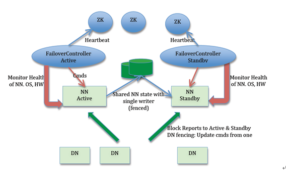

### 分布式文件系统

我们都知道`HDFS`是一种分布式文件系统。那么什么是`分布式文件系统`呢？分布式文件系统相对于本地文件系统，其最大的区别是跨多个机器而构成一个向用户提供统一视图的文件系统，从用户角度，分布式文件系统与本地文件系统并无太大区别，然而二者底层数据的存储与管理机制却是天差地别，分布式文件系统的数据是分布于多个机器上的。

分布式文件系统的设计目标包括：

1. 能够存储超大文件

   对于本地文件系统，由于磁盘容量限制，一个文件系统能够存储的文件是有上限的。而对于分布式文件系统，由于可以将多个机器联合起来存储文件，理论上可以存储任一大小的文件。

2. 解决本地文件系统的单点故障问题

   本地文件系统是一个单一的系统，一旦机器宕机，文件系统将不能在提供服务，数据无法访问。而分布式文件系统的一个重要目标就是解决这个单点故障问题，系统中某个机器出现故障并不会导致数据丢失，也不会影响用户的使用。

### HDFS 简介

`HDFS`（Hadoop Distributed File System）是一个开源的分布式文件系统，它基于谷歌的`GFS`理论。HDFS 是Hadoop框架中的一个核心组件，是分布式计算中数据存储管理的基础。

它具有高容错、高可靠性、高可扩展性、高吞吐率等特性。

### HDFS 优缺点

#### HDFS 优点

- 高容错性

  1) 数据自动保存多个副本。它通过增加副本的形式，提高容错性。

  2) 某一个副本丢失以后，它可以自动恢复，这是由 HDFS 内部机制实现的，我们不必关心。

- 适合批处理

  1) 它是通过移动计算而不是移动数据。

  2) 它会把数据位置暴露给计算框架。

- 适合大数据处理

  1) 数据规模：能够处理数据规模达到 GB、TB、甚至PB级别的数据。

  2) 文件规模：能够处理百万规模以上的文件数量，数量相当之大。

  3) 节点规模：能够处理10K节点的规模。

- 流式数据访问

  1) 一次写入，多次读取，不能修改，只能追加。

  2) 它能保证数据的一致性。

- 可构建在廉价机器上

  1) 它通过多副本机制，提高可靠性。

  2) 它提供了容错和恢复机制。比如某一个副本丢失，可以通过其它副本来恢复。

#### HDFS 缺点

- 不适合低延时数据访问

  1) 比如毫秒级的来存储数据，这是不行的，它做不到。

  2) 它适合高吞吐率的场景，就是在某一时间内写入大量的数据。但是它在低延时的情况  下是不行的，比如毫秒级以内读取数据，这样它是很难做到的。

- 无法高效的对大量小文件进行存储

  1) 存储大量小文件的话，它会占用  NameNode大量的内存来存储文件、目录和块信息。这样是不可取的，因为NameNode的内存总是有限的。

  2) 小文件存储的寻道时间会超过读取时间，它违反了HDFS的设计目标。

- 并发写入、文件随机修改

  1) 一个文件只能有一个写，不允许多个线程同时写。

  2) 仅支持数据 append（追加），不支持文件的随机修改。

### HDFS 整体架构

#### 单Namenode架构


#### NameNode + Secondary NameNode架构


还有支持HA机制的架构，后面会单独说明。

#### 角色

从架构图可以看出，HDFS主要包括以下几个角色：

- HDFS 客户端

  要访问HDFS，都需要通过客户端，HDFS提供了两种客户端：1）shell命令行客户端。 2）客户端Java API

- NameNode

  管理HDFS元数据，管理DataNode和整个集群。

- Secondary NameNode

  用于分担NameNode合并元数据的工作，减轻NameNode的负担。不是必须的。

  对于HA的集群，由Standby NameNode代替。

- DataNode

  真正存储文件的节点，大文件会被拆分成多个block，每个block默认128M。每个block会复制多个副本，默认三个。所有block以及副本会分散存储到各个DataNode节点上。

### HDFS 存储模型

在HDFS中，一个大的文件会被拆分成多个数据块（即block），默认情况下，每个block最大128M，最后一个block有可能小于128M。然后这些block分散存储到不同的DataNode上。

如下图所示，example.txt有700M，会被拆分成6个block，前5个每个128M，最后一个60M。


### HDFS 读写数据流程

#### 读文件流程


步骤解析：

1. 客户端传递一个文件Path给FileSystem的open方法
2. HDFS采用RPC远程获取文件最开始的几个block的datanode地址。Namenode会根据网络拓扑结构决定返回哪些节点（前提是节点有block副本），如果客户端本身是Datanode并且节点上刚好有block副本，直接从本地读取。
3. 客户端使用open方法返回的FSDataInputStream对象读取数据（调用read方法）
4. DFSInputStream（FSDataInputStream实现了该类）连接持有第一个block的、最近的节点，反复调用read方法读取数据
5. 第一个block读取完毕之后，寻找下一个block的最佳datanode，读取数据。如果有必要，DFSInputStream会联系Namenode获取下一批Block 的节点信息(存放于内存，不持久化），这些寻址过程对客户端都是不可见的。
6. 数据读取完毕，客户端调用close方法关闭流对象

在读数据过程中，如果与Datanode的通信发生错误，DFSInputStream对象会尝试从下一个最佳节点读取数据，并且记住该失败节点， 后续Block的读取不会再连接该节点

读取一个Block之后，DFSInputStram会进行检验和验证，如果Block损坏，尝试从其他节点读取数据，并且将损坏的block汇报给Namenode。

客户端连接哪个datanode获取数据，是由namenode来指导的，这样可以支持大量并发的客户端请求，namenode尽可能将流量均匀分布到整个集群。

Block的位置信息是存储在namenode的内存中，因此相应位置请求非常高效，不会成为瓶颈。

#### 写文件流程


步骤解析：

1. 客户端调用DistributedFileSystem的create方法
2. DistributedFileSystem远程RPC调用Namenode在文件系统的命名空间中创建一个新文件，此时该文件没有关联到任何block。 这个过程中，Namenode会做很多校验工作，例如是否已经存在同名文件，是否有权限，如果验证通过，返回一个FSDataOutputStream对象。 如果验证不通过，抛出异常到客户端。
3. 客户端写入数据的时候，DFSOutputStream分解为packets，并写入到一个数据队列中，该队列由DataStreamer消费。
4. DateStreamer负责请求Namenode分配新的block存放的数据节点。这些节点存放同一个Block的副本，构成一个管道。 DataStreamer将packer写入到管道的第一个节点，第一个节点存放好packer之后，转发给下一个节点，下一个节点存放 之后继续往下传递。
5. DFSOutputStream同时维护一个ack queue队列，等待来自datanode确认消息。当管道上的所有datanode都确认之后，packer从ack队列中移除。
6. 数据写入完毕，客户端close输出流。将所有的packet刷新到管道中，然后安心等待来自datanode的确认消息。全部得到确认之后告知Namenode文件是完整的。 Namenode此时已经知道文件的所有Block信息（因为DataStreamer是请求Namenode分配block的），只需等待达到最小副本数要求，然后返回成功信息给客户端。

##### Block副本放置策略

HDFS在写入文件时，对于文件block的各个副本放置到哪个节点，会采取一定的策略。

如下图所示，第一个副本放置在client访问的第一个节点上，另外两个副本放置到与第一个副本不同的机架上，且第二个和第三个副本放置到同一个机架上的不同节点上。


以上是目前新版本的放置策略，老版本的HDFS的副本放置策略略有不同，如下：


#### 节点距离


在读取和写入的过程中，namenode在分配Datanode的时候，会考虑节点之间的距离。HDFS中，距离没有采用带宽来衡量，因为实际中很难准确度量两台机器之间的带宽。

HDFS把机器之间的拓扑结构组织成树结构，并且用到达公共父节点所需跳转数之和作为距离。

计算出节点之间的距离后，HDFS在读取或写入时会根据距离优先选择距离较近节点。

### HDFS 元数据管理

#### 元数据

HDFS中的元数据包括fsimage和edit log。

Edit Log：当写入数据时，HDFS会记录一条日志到Edit Log中，如下图所示：


fsimage: 

在安装HDFS并首次启动前，需要运行格式化指令，它就是用于产生一个空的fsimage文件。


#### 元数据合并


引入Secondary NameNode实现元数据合并


引入SecondaryNamenode，它的作用就是提高Namenode的恢复速度，大致对操作步骤进行一个阐述：

1. SecondaryNameNode 会通过http get方式把edits     log和fsimage的信息拉取过来
2. 在SecondaryNameNode中把edits log和fsimage做一个合并，产生一个新的文件叫做 fsimage.ckpt
3. 在SecondaryNameNode中合并完成之后，再回传给NameNode里面
4. 这时大概率会有客户端还在对NameNode进行读写操作，也会产生新的日志，此时按照先前未引入SNN的套路继续即可。 在HA方案中这个行为可以交给standby去完成。

### HDFS HA 机制

#### 两种HA机制

- 基于NFS

  

- 基于QJM（Quorum Journal Manager)共享存储

  

#### 基于QJM的HA机制

基于QJM的HA机制是推荐的HA机制，因此这里单独加以说明。

**引入JournalNode实现共享存储**


**引入Zookeeper和ZKFC实现故障自动切换**


**自动切换详细流程**


**防止脑裂**


### HDFS 联邦机制

联邦（Federation）机制主要用于突破单个NameNode集群的限制。

#### Federation架构


**Block Pool（块池）**

- Block Pool允许一个命名空间在不通知其他命名空间的情况下为一个新的block创建Block ID。同时一个Namenode失效不会影响其下Datanode为其他Namenode服务。
- 每个Block Pool内部自治，也就是说各自管理各自的block，不会与其他Block Pool交流。一个Namenode挂掉了，不会影响其他NameNode。
- 当DN与NN建立联系并开始会话后自动建立Block Pool。每个block都有一个唯一的标识，这个标识我们称之为扩展块ID,在HDFS集群之间都是惟一的，为以后集群归并创造了条件。
- DN中的数据结构都通过块池ID索引，即DN中的BlockMap，storage等都通过BPID索引。
- 某个NN上的NameSpace和它对应的Block Pool一起被称为NameSpace Volume。它是管理的基本单位。当一个NN/NS被删除后，其所有DN上对应的Block Pool也会被删除。当集群升级时，每个NameSpace Volume作为一个基本单元进行升级。

**ClusterID**

- 增加一个新的ClusterID来标识在集群中所有的节点。当一个Namenode
- 被格式化的时候，这个标识被指定或自动生成，这个ID会用于格式化集群中的其它Namenode。

#### ViewFS


如上图所示，下面四个深色三角形代表一个独立的命名空间，上方浅色的三角形代表从客户角度去访问的子命名空间。各个深色的命名空间Mount到浅色的表中，客户可以访问不同的挂载点来访问不同的命名空间，这就如同在Linux系统中访问不同挂载点一样。这就是HDFS Federation中命名空间管理的基本原理：将各个命名空间挂载到全局mount-table中，就可以做将数据到全局共享；同样的命名空间挂载到个人的mount-table中，这就成为应用程序可见的命名空间视图。

当使用Federation机制搭建HDFS集群时，我们需要修改`fs.defaultFS`为`viewfs`，并指定`ClusterID`，如下：

```xml
<property>
  <name>fs.defaultFS</name>
  <value>viewfs://clusterX</value>
</property>
```

