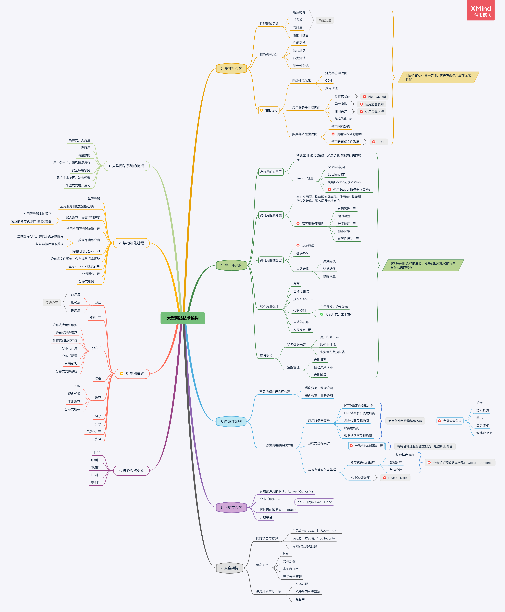

### 一、介绍一下

《大型网站技术架构》这本书可能很多人都看过，小编个人觉得真的是非常不错的一本书。

看完这本书后，你会对如何设计大型网站架构，有非常清晰的思路。

如果还没有读过的小伙伴，赶紧去读一读吧。

> PS：小编这里有这本书的Kiddle电子版，如有需要可联系我获取哦！

### 二、架构思路

#### 1. 大型网站系统特点

既然谈的是大型网站架构，所谓"大型"网站，首先需要了解大型网站系统具有什么样的特点。

一般大型网站系统都具有如下共同特点：

*   高并发，大流量
    
*   高可用
    
*   海量数据
    
*   用户分布广，网络情况复杂
    
*   安全环境恶劣
    
*   需求快速变更，发布频繁
    
*   渐进式发展和演化

#### 2. 大型网站架构核心要素

基于大型网站系统的特点，需要围绕这些特点来设计系统架构。 基于此，可以概括出设计大型网站需要考虑的核心架构要素。

设计大型网站系统的核心架构要素：

*   高性能
    
*   高可用性
    
*   可伸缩性
    
*   可扩展性
    
*   安全性
    

  本书的核心内容其实就是针对这几个核心架构要素一一展开。   

### 三、设计『 高性能 』的网站架构

对于大型网站，设计高性能的架构一般从以下几个方面考虑：

*   优化网站响应速度
    
*   优化网站处理并发请求的能力
    
*   优化数据存储的性能
    

所谓高性能，

从网站的用户角度来看，无非就是访问网站的『 **响应速度要快** 』。

从系统角度看，由于同时访问的用户数巨大，因此同时到达系统服务器的『 **并发请求数** 』非常大。

从后端数据存储来看，优化『 **海量数据存储** 』的能力，避免后端数据存储性能缓慢而成为系统性能瓶颈。

#### 1. 优化网站响应速度

> **重要提示：**
> 
> 网站性能优化第一定律：优先考虑使用缓存技术优化性能

优化网站响应速度的主要手段是使用『 **缓存** 』，使用缓存是提高网站响应速度效果最显著的办法。

例如对于前端，可以使用`CDN`，反向代理，这些都是利用的缓存技术。

对于应用服务器的性能优化，一个主要的手段也是使用缓存，在提高响应速度的同时，也减轻了对后端数据库的压力。

如果是有海量数据的超大型系统，甚至需要用到分布式缓存系统。

另外一个优化响应速度的手段是『 **异步消息处理** 』。异步消息处理是指，在应用服务器与后端服务之间使用消息队列，应用服务器总是将用户请求扔进消息队列，并立即返回用户，后端服务异步从消息队列中取出请求数据进行处理。由于请求发送到消息队列后就立即返回了，因此用户会感知到更快的响应速度。

使用消息队列还具有削峰的作用，当瞬间有大量请求到达系统后，这些请求数据会进入消息队列，而不会瞬间涌入后端服务器，从而起到保护后端服务的作用。

#### 2. 优化网站处理并发请求的能力

除此之外，还要支持巨大的并发请求数，一般手段是使用『 **集群** 』。

应用服务器一般需要从单台服务器扩展为多台服务器，构成应用服务器集群，然后引入负载均衡服务器，将用户请求分摊到不同的应用服务器进行处理。

集群可以很容易进行伸缩（增加或减少服务器数量），因此可以有效支持在不同场景下的不同并发请求量。如秒杀场景下，可以快速增加服务器到集群中，从而分摊用户请求，减轻其他服务器的压力。

#### 3. 优化数据存储的性能

单从优化数据存储性能方面来看，主要的优化手段有：

*   使用性能更高的硬盘，如使用固态硬盘，读写速度更快。
    
*   替换传统关系型数据库，使用`NoSQL`数据库。`NoSQL`数据库的数据读写速度一般优于传统关系型数据库。
    
*   使用分布式文件系统。分布式文件系统具有并发读写能力，因此可以有效提高数据存储的并发能力。
    

### 四、设计『 高可用 』的网站架构

> **重要提示：**
> 
> 实现高可用架构的主要手段是数据和服务的『 **冗余备份** 』和『 **失效转移** 』

所谓高可用，即在任何时刻，应该尽量保证系统是可用的。

使用集群实现数据和服务的冗余备份，当集群中某个服务器宕机时，失效转移机制会将用户请求分发到集群中其他可用服务器上，从而可以保证用户请求被正确处理。

使用集群有个前提条件是，各个服务器上运行的服务应尽量是无状态的这样各个服务器之间就不会存在差异。但是对于应用服务器，如果保存了用户`Session`数据，那么它们就是有状态的。这种情况下需要考虑如何处理`Session`状态数据。可以采用独立的分布式`Session`服务器集群来专门缓存用户`Session`数据，从而使应用服务器变成无状态的。

冗余备份与失效转移手段适用于网站系统的各个逻辑层，包括应用层，服务层和数据层。

### 五、设计『 可伸缩 』的网站架构

系统的可伸缩性，通常容易与可扩展性混淆。

可伸缩性意味着当网站流量变大时，可以很容易通过增加系统部署实例来支持。可扩展性意味着系统架构可以很容易扩展，从而支持新业务功能系统。

为达到可伸缩的目的，通常需要将系统进行拆分。纵向进行逻辑分层，如分为应用层，服务层和数据层。横向进行业务分割，把不同的业务功能拆分出来，并且独立部署。

对于拆分出来的单一功能，也需要采用集群方式进行部署。但是对于不同类型的集群，实现伸缩的方式不太一样。

对于应用服务器集群，通常使用『 **负载均衡** 』来实现伸缩。当有新服务器加入集群时，负载均衡可以自动将用户请求分发到新服务器。

对于分布式缓存集群，当有新服务器加入集群时，为了保证缓存命中率，通常使用『 **一致性** 』算法，从而使请求能够绝大部分指向已经缓存了所需数据的服务器。

对于数据存储服务器集群，对传统关系数据库来说，通常的手段是进行『 **主、从数据库复制** 』实现读写分离，或者『 **数据分库分片** 』等。然而对于`NoSQL`数据库，很多`NoSQL`数据库天生就是为可伸缩海量数据存储而设计的，如`HBase`。

### 六、设计『 可扩展 』的网站架构

网站系统架构应该是易于扩展的。通常的设计手段包括：

*   使用分布式消息队列降低系统与系统之间的耦合性。
    
    当开发新系统后，只需要订阅消息队列的数据即可进行整合，而不需要修改已有其他系统。
*   利用分布式服务抽取可复用的服务。
    
    对于通用业务功能，可以把它们抽取成可复用的服务。 对于新业务需求，通常可以使用这些可复用的服务，进行简单的组装即可实现。
*   使用具有可扩展的数据库。
    
    如使用支持`ColumnFamily`结构的`NoSQL`数据库，可以在现有数据表结构之上增删数据列。
*   开放平台。
    
    通过开放平台接入第三方开发者开发的系统，扩展系统周边应用，形成生态圈。

 

### 七、设计『 安全 』的网站架构

系统安全性，对于任何网站系统都是至关重要的。

对于大型网站，由于用户分布广，网络安全环境会更加复杂和恶劣，设计具有良好安全性的网站架构会更加具有挑战性。

一般可以考虑以下几个方面：

*   防御常见的网站攻击手段。如`XSS`，注入攻击，`CSRF`攻击等。
    
*   信息加密。对在网络中传输的数据进行加密后再传输。
    
*   信息过滤。过滤掉垃圾信息，防止垃圾信息进入系统内部。
    

### 八、思维导图

以下是我亲自整理的思维导图:

如果上面的大图看着不方便，我也把它放在了Github，访问我的[Github地址](https://github.com/longyg/Study")下载，然后用`XMind`打开轻松看，包括图里的详细标注也可以看得到啦。
