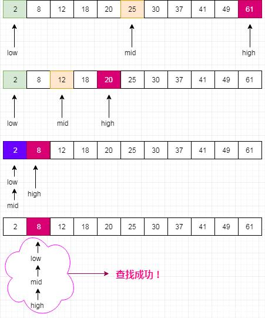

### 一、算法介绍

`二分查找`算法是一种效率比较高的查找算法，也称为`折半查找`。所谓`查找算法`，就是从一系列数中（即数组）查找某个数字。然而二分查找只适用于排序好的数组，对于乱序数组，要求先排好序才能使用二分查找。

`二分查找`就是每次取数组中间位置的数与要查找的数比较，如果比要查找的数小，就排除左边一半数组，只在右边剩下一半数组中继续查找。相反，如果数组中间的数比要查找的数大，就排除右边一半数组，接下来继续从左边剩下一半数组中查找。如此，每比较一次就缩小一半查找范围。

如下图所示，假如要查找数字8，查找过程为：



### 二、 Java实现

```java
package searching;

/**
 * 二分查找
 *
 * 从有序的数组中找到某个数
 */
public class BinarySearch {

    /**
     *
     * @param array 已排序的数组
     * @param v 要查找的数字
     * @return 要查找的数字在数组中的位置， -1表示不存在
     */
    public static int binarySearch(int[] array, int v) {
        int low = 0;
        int high = array.length - 1;

        while (low <= high) {
            int mid = low + (high - low) / 2; // 计算数组中间位置
            int current = array[mid]; // 取出中间位置的数
            // 与数组中间的数比较
            if (current == v) {
                // 如果相等，就直接返回中间位置
                return mid;
            }
            if (current > v) {
                // 如果中间位置的数比要查找的数大， 就将数组最高位移动到当前数组的中间位置
                high = mid - 1;
            } else {
                // 相反，就将数组最低位移动到当前数组的中间位置
                low = mid + 1;
            }
        }

        // 如果无法找到，返回-1
        return -1;
    }
}
```

### 三、 Python实现

```python
def binary_search(array, v):
    low = 0
    high = len(array) - 1
    while low <= high:
        mid = low + (high - low) // 2
        current = array[mid]
        if current == v:
            return mid
        if current > v:
            high = mid - 1
        else:
            low = mid + 1
    return -1

if __name__ == "__main__":
    my_list = [1, 2, 3, 4, 5, 6, 7, 8]
    print(binary_search(my_list, 6))
```

